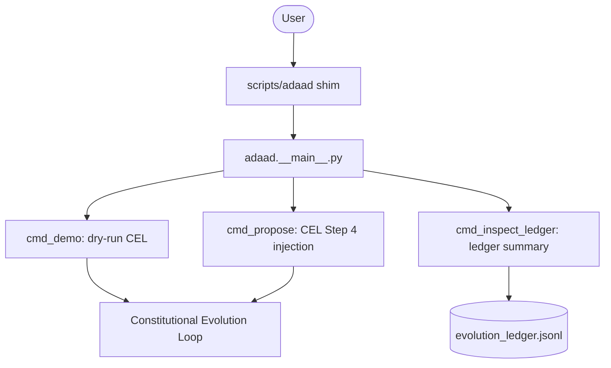

# SPDX-License-Identifier: Apache-2.0
# ADAAD System Architecture

## CLI Data Flow (Phase 123)

The `adaad` CLI provides a unified entry point for interacting with the governance runtime.

## Governance Invariants

- **CLI-SANDBOX-0**: All CLI-initiated mutations default to sandbox-only execution.
- **CLI-GATE-0**: Proposals via CLI must traverse the same 16-step CEL pipeline as autonomous proposals.

## Module Map

| Layer | Module | Responsibility |
|:---|:---|:---|
| Interface | `adaad.__main__.py` | Command routing, argument parsing, sandbox guarding. |
| Interface | `scripts/adaad` | POSIX shim for local execution. |
| Runtime | `app/main.py` | Full autonomous loop orchestrator. |
| Core | `adaad/core/` | Governance-critical primitives. |
| Evolution | `runtime/evolution/` | 16-step CEL implementation. |
| Ledger | `security/ledger/` | Tamper-evident hash-chained records. |
