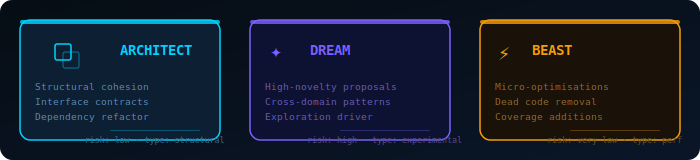

<div align="center">

<picture>
  <source media="(prefers-color-scheme: dark)" srcset="docs/assets/adaad-hero.svg">
  <source media="(prefers-color-scheme: light)" srcset="docs/assets/adaad-hero.svg">
  
</picture>

<br/><br/>

[](https://github.com/InnovativeAI-adaad/ADAAD/releases)&nbsp;[](ROADMAP.md)&nbsp;[](docs/CONSTITUTION.md)&nbsp;[](LICENSE)

<br/>

[](https://github.com/InnovativeAI-adaad/ADAAD/actions/workflows/ci.yml)&nbsp;&nbsp;&nbsp;&nbsp;

<br/>

&nbsp;&nbsp;&nbsp;&nbsp;

<br/><br/>

**[⚡ Get Started in 5 Minutes](QUICKSTART.md)** &nbsp;·&nbsp; **[📜 The 23 Rules](docs/CONSTITUTION.md)** &nbsp;·&nbsp; **[🗺 Roadmap](ROADMAP.md)** &nbsp;·&nbsp; **[🔬 Live Example](examples/)** &nbsp;·&nbsp; **[📖 Agent Spec](AGENTS.md)** &nbsp;·&nbsp; **[📱 Android Guide](INSTALL_ANDROID.md)**

</div>

<br/>

<div align="center">─────────────────────────── ◈ ───────────────────────────</div>

<br/>

## The Case

Every AI code tool does the same thing: **suggest → you apply.**
No memory of what worked. No fitness score. No audit trail. No rollback. No constitutional constraint on what it can touch. You are always the last line of defense.

> [!IMPORTANT]
> **ADAAD is different in kind, not degree.**
>
> It is a production-grade autonomous code evolution engine that improves your codebase epoch by epoch — every mutation **cryptographically signed**, **hash-chained** into a tamper-evident ledger, **deterministically replayable**, and subject to a **23-rule constitutional gate** before a single byte changes. It runs a 14-step governed evolution loop. It scores proposals against 7 independent fitness signals. It runs on a $200 Android phone. It is Apache 2.0, forever free.
>
> ***It has already evolved itself. That happened. The hash is in the ledger.***

<br/>

<div align="center">─────────────────────────── ◈ ───────────────────────────</div>

## What Makes This Different

<table>
<thead>
<tr>
<th align="left" width="45%">Every Other AI Code Tool</th>
<th align="left" width="55%">ADAAD</th>
</tr>
</thead>
<tbody>
<tr>
<td>Suggest → human applies</td>
<td>✅ Propose → Evaluate → Gate → Apply <strong>atomically</strong></td>
</tr>
<tr>
<td>No memory between sessions</td>
<td>✅ Full lineage ledger — epoch by epoch, SHA-256 hash-chained</td>
</tr>
<tr>
<td>No audit trail</td>
<td>✅ Tamper-evident evidence ledger — every decision cryptographically provable</td>
</tr>
<tr>
<td>Safety is optional, bolt-on</td>
<td>✅ <code>GovernanceGate</code> is the <strong>only</strong> approval surface — invariant <code>GOV-SOLE-0</code></td>
</tr>
<tr>
<td>Can't prove what it did</td>
<td>✅ Every decision is deterministically replayable, byte-identical</td>
</tr>
<tr>
<td>Server-only, enterprise-priced</td>
<td>✅ Runs on a $200 Android phone — Apache 2.0, free forever</td>
</tr>
<tr>
<td>Human is the safety layer</td>
<td>✅ Constitutional governance <em>is</em> the safety layer — structural, not advisory</td>
</tr>
<tr>
<td>Static scoring weights</td>
<td>✅ <code>AdaptiveWeights</code> — EMA momentum descent from post-merge telemetry</td>
</tr>
<tr>
<td>No replay proof</td>
<td>✅ <code>replay_verifier.py</code> — zero divergence enforced, any delta = auto-rollback</td>
</tr>
</tbody>
</table>

<br/>

<div align="center">─────────────────────────── ◈ ───────────────────────────</div>

## Live System Status

<div align="center">

| Component | Status | Constitutional Invariant |
|:---:|:---:|:---:|
| GovernanceGate | 🟢 &nbsp;**ACTIVE** | `GOV-SOLE-0` |
| Constitutional Evolution Loop | 🟢 &nbsp;**ENABLED** | `CEL-ORDER-0` |
| Evidence Ledger | 🟢 &nbsp;**HASH-CHAINED** | `CEL-EVIDENCE-0` |
| SandboxTournament | 🟢 &nbsp;**OPERATIONAL** | `SANDBOX-DIV-0` |
| FitnessEngine v2 | 🟢 &nbsp;**SCORING** | `FIT-BOUND-0` |
| Deterministic Replay | 🟢 &nbsp;**VERIFIED** | `DET-ALL-0` |
| Autonomous Self-Evolution | 🟢 &nbsp;**PHASE 65 PROVEN** | `MUTATION-TARGET` |

</div>

<br/>

<div align="center">─────────────────────────── ◈ ───────────────────────────</div>

## Architecture

<div align="center">

</div>

<br/>

Three LLM-backed agents — **Architect**, **Dream**, **Beast** — compete for epoch selection via bandit algorithm. Every winning proposal traverses the full **14-step Constitutional Evolution Loop** before a single byte changes. The `GovernanceGate` is the sole approval surface. Invariant `GOV-SOLE-0`: it cannot be bypassed. Ever.

<br/>

<div align="center">

</div>

<br/>

<div align="center">─────────────────────────── ◈ ───────────────────────────</div>

## The Constitutional Evolution Loop

All 14 steps execute in strict sequence. One failure → clean halt. Zero silent errors. Invariant: **`CEL-ORDER-0`**.

```
╔══════════════════════════════════════════════════════════════════════════════════╗
║                   CONSTITUTIONAL EVOLUTION LOOP  ·  14 STEPS                    ║
╠══════════════════════════════════════════════════════════════════════════════════╣
║                                                                                  ║
║  [01]  MODEL-DRIFT-CHECK   →  Determinism guard — blocks if determinism stale    ║
║  [02]  LINEAGE-SNAPSHOT    →  Capture capability_graph_before hash               ║
║  [03]  FITNESS-BASELINE    →  Record pre-epoch 7-signal composite score          ║
║  [04]  PROPOSAL-GENERATE   →  LLM-backed mutations — Architect / Dream / Beast   ║
║  [05]  AST-SCAN            →  StaticSafetyScanner — 4 hard rules (preflight)     ║
║  [06]  SANDBOX-EXECUTE     →  Ephemeral clone execution — respects SANDBOX_ONLY  ║
║  [07]  REPLAY-VERIFY       →  Hash match — any divergence = automatic rollback   ║
║  [08]  FITNESS-SCORE       →  7 signals scored and bounded — determinism veto    ║
║  [09]  GOVERNANCE-GATE-V2  →  5 diff-aware AST rules (Phase 63)                  ║
║  [10]  GOVERNANCE-GATE     →  23 constitutional rules — ALL must pass            ║
║  [11]  LINEAGE-REGISTER    →  Register survivors in lineage chain                ║
║  [12]  PROMOTION-DECISION  →  CapabilityGraph + PromotionEvent (skipped in SANDBOX)║
║  [13]  EPOCH-EVIDENCE      →  SHA-256 hash-chained ledger entry written          ║
║  [14]  STATE-ADVANCE       →  Epoch counter advanced — emit epoch_complete.v1    ║
║                                                                                  ║
╚══════════════════════════════════════════════════════════════════════════════════╝
```

<br/>

<div align="center">─────────────────────────── ◈ ───────────────────────────</div>

## The 23 Constitutional Rules

<details>
<summary><strong>🔴 9 Blocking Rules — Unconditionally reject any violating mutation</strong></summary>

<br/>

| Rule | Description |
|:---|:---|
| `single_file_scope` | Mutations must be confined to a single target file |
| `ast_validity` | Resulting AST must be syntactically valid — no syntax errors permitted |
| `no_banned_tokens` | No `exec`, `eval`, `os.system`, or equivalent constructs |
| `signature_required` | All mutations must carry a valid cryptographic signature |
| `lineage_continuity` | Mutation must chain to an existing lineage record |
| `resource_bounds` | Memory and compute bounds enforced per mutation class |
| `federation_dual_gate` | Cross-repo mutations require GovernanceGate approval in both repos |
| `federation_hmac_required` | HMAC key validation required for all federation operations |
| `soulbound_privacy_invariant` | No export of identity-linked data outside governed channels |

</details>

<details>
<summary><strong>🟡 5 Warning Rules — Flag and continue (blocking in PRODUCTION tier)</strong></summary>

<br/>

| Rule | Description |
|:---|:---|
| `max_complexity_delta` | Cyclomatic complexity increase must be ≤ +2 |
| `test_coverage_maintained` | Coverage must not decrease as a result of the mutation |
| `max_mutation_rate` | Epoch mutation density within bounded rate — anti-flood |
| `import_smoke_test` | All new imports must resolve without error |
| `entropy_budget_limit` | Proposal entropy within deterministic bounds |

</details>

<details>
<summary><strong>🔵 9 Advisory Rules — Informational, captured in all audit trails</strong></summary>

<br/>

| Rule | Description |
|:---|:---|
| `deployment_authority_tier` | Tier-based deployment authority verification |
| `revenue_credit_floor` | Credit floor enforcement for contributor attribution |
| `reviewer_calibration` | Historical reviewer calibration scoring |
| `bandit_arm_integrity_invariant` | UCB1 / Thompson Sampling internal state validation |
| `market_signal_integrity_invariant` | Market signal provenance verification |
| `+5 GovernanceGateV2 AST rules` | Phase 63 diff-aware AST compliance (all 5 rules) |

</details>

<br/>

<div align="center">─────────────────────────── ◈ ───────────────────────────</div>

## 8 Permanent Architectural Invariants

Enforced at the **code level**, not policy level. No mutation, configuration, flag, or runtime override can touch these.

```yaml
# ─── ARCHITECTURAL INVARIANTS  ·  ADAAD v9.1.0 ──────────────────────────────
#     Enforcement: code-level  ·  Override: impossible  ·  Audit: permanent
# ─────────────────────────────────────────────────────────────────────────────

GOV-SOLE-0:      GovernanceGate is the sole mutation approval surface — no bypass exists
DET-ALL-0:       All governance decisions are deterministic and replay-identical
SIM-BLOCK-0:     simulation=True blocks ALL live side-effects — zero bleed to production
SANDBOX-DIV-0:   AST hash must match post-apply — any divergence = automatic rollback
PATCH-SIZE-0:    Maximum 40 delta AST nodes, maximum 2 files per patch
TIER0-SELF-0:    Tier-0 bound modules cannot self-mutate — ever, under any condition
LINEAGE-STAB-0:  Lineage stable iff ≥ 2/5 last epochs passed fitness + gate checks
CEL-ORDER-0:     All 14 CEL steps execute in strict sequence — no skipping allowed
```

<br/>

<div align="center">─────────────────────────── ◈ ───────────────────────────</div>

## Fitness Engine — 7 Signals

Every mutation proposal is scored across 7 independent signals before `GovernanceGate` evaluates it. **Determinism divergence is an unconditional veto (`FIT-DIV-0`)** — it does not participate in scoring and cannot be overridden.

| Signal | Weight Bound | Notes |
|:---|:---:|:---|
| 🧪 Test coverage delta + failure reduction | `[0.05, 0.70]` | Rewards mutations that improve pass rates |
| 🌀 Cyclomatic complexity delta | `[0.05, 0.70]` | Penalizes complexity increases above threshold |
| ⚡ Performance benchmark delta | `[0.05, 0.70]` | Measures per-mutation runtime impact |
| 📊 Governance compliance (10-epoch rolling) | `[0.05, 0.70]` | Historical track record of this mutation class |
| 🏗 Architectural fitness — coupling & centrality | `[0.05, 0.70]` | Rewards improved dependency structure |
| 🔒 Determinism — replay divergence | `[0.05, 0.70]` | **Hard floor: zero divergence required** |
| 🧹 Net node additions (deletion rewarded) | `[0.05, 0.70]` | Rewards codebase shrinkage over growth |

**`AdaptiveWeights`:** EMA momentum descent (LR=0.05) adjusts signal weights from post-merge telemetry. `NonStationarityDetector` (Page-Hinkley test) switches to Thompson Sampling after ≥ 30 epochs of detected reward non-stationarity.

<br/>

<div align="center">─────────────────────────── ◈ ───────────────────────────</div>

## Three Competing Mutation Agents

<div align="center">

</div>

```
  ┌──────────────────────┐    ┌──────────────────────┐    ┌──────────────────────┐
  │      ARCHITECT       │    │        DREAM         │    │        BEAST         │
  │                      │    │                      │    │                      │
  │  Methodical          │    │  Creative            │    │  Aggressive          │
  │  Conservative        │    │  Exploratory         │    │  Max throughput      │
  │  Structural focus    │    │  Novel pathways      │    │  Hard-filtered       │
  │  Low entropy delta   │    │  High novelty score  │    │  Volume + velocity   │
  └──────────┬───────────┘    └──────────┬───────────┘    └──────────┬───────────┘
             └───────────────────────────┼───────────────────────────┘
                                         │  up to 12 candidates / epoch
                          ┌──────────────▼──────────────┐
                          │       BANDIT SELECTOR        │
                          │                              │
                          │  UCB1 multi-armed bandit     │
                          │  Thompson Sampling (≥30 ep.) │
                          │  BLX-alpha GA crossover      │
                          └──────────────┬───────────────┘
                                         │
                          ┌──────────────▼──────────────┐
                          │       GOVERNANCE GATE        │
                          │                              │
                          │  23 constitutional rules     │
                          │  Non-bypassable  GOV-SOLE-0  │
                          │  Every decision audited      │
                          │  Every decision replayable   │
                          └─────────────────────────────┘
```

<br/>

<div align="center">─────────────────────────── ◈ ───────────────────────────</div>

## Mutation Tier System

| Tier | Paths | Autonomous Authority | Human Review |
|:---|:---|:---:|:---|
| **🔴 Tier 0 — Production** | `runtime/`, `security/`, `app/main.py` | ❌ Never | **Required before any merge** |
| **🟡 Tier 1 — Stable** | `tests/`, `docs/`, most agents | ✅ Auto + full audit trail | Reviews logs within 24h |
| **🟢 Tier 2 — Sandbox** | `app/agents/test_subject/` | ✅ Fully autonomous | Zero blast radius to other tiers |

<br/>

<div align="center">─────────────────────────── ◈ ───────────────────────────</div>

## Quick Start

**Server / Desktop / CI:**

```bash
git clone https://github.com/InnovativeAI-adaad/ADAAD.git && cd ADAAD

python -m venv .venv && source .venv/bin/activate
pip install -r requirements.server.txt

# Always validate first — boot preflight
PYTHONPATH=. python -m pytest tests/test_boot_preflight.py -q

# Full suite — 4,441 tests
PYTHONPATH=. python -m pytest tests/ -q

# Dry-run evolution — SANDBOX_ONLY guarantees zero writes, zero risk
ADAAD_CEL_ENABLED=true ADAAD_SANDBOX_ONLY=true ADAAD_ENV=dev python app/main.py
```

**Android — Termux / Pydroid3:**

```bash
pip install -r requirements.phone.txt

# Dev mode — no governance keys required to explore
CRYOVANT_DEV_MODE=1 ADAAD_ENV=dev python app/main.py --host 0.0.0.0 --port 8000
```

> [!TIP]
> **`ADAAD_SANDBOX_ONLY=true`** is always safe as a first run. The full 14-step CEL executes — proposals are evaluated, fitness-scored, and gate-checked — but no patches are applied to the live codebase. Zero risk. Full observability.

> Full setup: **[QUICKSTART.md](QUICKSTART.md)** · Android: **[INSTALL_ANDROID.md](INSTALL_ANDROID.md)** · Phone: **[PHONE_SETUP.md](PHONE_SETUP.md)**

<br/>

<div align="center">─────────────────────────── ◈ ───────────────────────────</div>

## ⛓ Phase 65 — First Autonomous Self-Evolution

*On March 13, 2026, ADAAD produced its first fully governed autonomous self-improvement cycle. Zero human intervention in the execution path. Full human oversight of the constitutional framework. Every step cryptographically evidenced and deterministically replayable.*

```json
{
  "event":   "EPOCH_COMPLETE",
  "phase":   65,
  "version": "9.0.0",
  "date":    "2026-03-13",

  "constitutional_invariants_enforced": [
    "MUTATION-TARGET", "AUDIT-0", "REPLAY-0",
    "CEL-ORDER-0", "CEL-EVIDENCE-0", "SANDBOX-DIV-0", "GATE-V2-EXISTING-0"
  ],

  "execution_trace": {
    "01_TARGET_DISCOVERY":   "✓ CodeIntelModel → highest-priority Tier-1 capability identified",
    "02_CAPABILITY_MAP":     "✓ CapabilityDiscovery → cap:runtime.evolution.cel_wiring.live_mode",
    "03_PROPOSAL_GENERATE":  "✓ ProposalEngine → AST-level mutation — proposal_hash recorded",
    "04_STATIC_SCAN":        "✓ StaticSafetyScanner → all 4 AST safety rules PASS",
    "05_SANDBOX_TOURNAMENT": "✓ SandboxTournament → top candidate recorded in ephemeral container",
    "06_FITNESS_SCORE":      "✓ FitnessEngineV2 → 7/7 signals above baseline — composite PASS",
    "07_GOVERNANCE_GATE_V2": "✓ GovernanceGateV2 → APPROVED (Class A — no exception token required)",
    "08_GOVERNANCE_GATE":    "✓ GovernanceGate → CONFIRMED — all 23 constitutional rules pass",
    "09_PATCH_APPLY":        "✓ ASTDiffPatch → applied atomically — replay_verifier: 0 divergences",
    "10_CAPABILITY_UPDATE":  "✓ CapabilityGraph → target version bumped, CapabilityChange written",
    "11_EPOCH_EVIDENCE":     "✓ EpochEvidence → SHA-256 hash-chained into evolution ledger",
    "12_HUMAN_OVERSIGHT":    "✓ Full audit trail reviewed in Aponi — acknowledgement hash committed"
  },

  "replay_divergences":   0,
  "governance_bypasses":  0,
  "retroactive_evidence": false,
  "silent_failures":      0,
  "evidence_artifacts":   "artifacts/governance/phase65/"
}
```

<br/>

<div align="center">─────────────────────────── ◈ ───────────────────────────</div>

## Codebase at a Glance

<div align="center">

| Metric | Value |
|:---|:---|
| **Version** | `9.1.0` — Phase 66: Foundation Hardening |
| **Runtime Python files** | 329 |
| **Test files** | 267 |
| **Total test LOC** | ~37,000 |
| **Passing tests** | **4,441** |
| **Constitutional rules** | **23** (Constitution v0.9.0) |
| **Architectural invariants** | 8 — code-level, non-overridable |
| **Development phases completed** | **66** |
| **Android support** | Full — Termux + Pydroid3 |
| **First autonomous self-evolution** | ✅ Phase 65 — March 13, 2026 |

</div>

<br/>

<div align="center">─────────────────────────── ◈ ───────────────────────────</div>

## Governance Authority Chain

```
CONSTITUTION.md
    └─► ARCHITECTURE_CONTRACT.md
            └─► ARCHITECT_SPEC_v9.x.md
                    └─► ADAAD_PR_PROCESSION_2026-03-v2.md
                                │
                                ▼
                    GovernanceGate  (GOV-SOLE-0)
                    23 rules  ·  Non-bypassable
                    Every mutation  ·  Every epoch
```

<br/>

<div align="center">─────────────────────────── ◈ ───────────────────────────</div>

## Project Structure

```
ADAAD/
├── app/                   # Orchestrator, agents, mutation cycle, FastAPI server
├── runtime/               # Core engine — governance, evolution, fitness, federation
│   ├── evolution/         # CEL, lineage ledger, fitness engine, replay attestation
│   ├── governance/        # Constitutional gate, 23 rules, federation, rate limits
│   ├── autonomy/          # Bandit selector, weight adaptor, non-stationarity
│   └── sandbox/           # Ephemeral container execution, preflight checks
├── security/              # Cryovant auth, key management, session governance
├── tests/                 # 267 test files — 4,441 passing
├── docs/                  # Architecture docs, constitution, governance specs
│   └── assets/            # SVG diagrams and visual assets
├── governance/            # Constitutional rules, federation keys, attestations
├── schemas/               # JSON schemas for all governance artifacts
├── tools/                 # Linters, audit tools, import boundary enforcement
├── scripts/               # CI/CD, retention enforcement, signing scripts
├── ui/                    # Aponi dashboard (Python + HTML)
├── android/               # Android build, F-Droid, Play Store assets
├── artifacts/             # Governance evidence artifacts (per-phase)
├── _inbox/                # Working documents, proposals (non-canonical)
├── QUICKSTART.md          # 5-minute setup guide
├── AGENTS.md              # Build agent protocol spec (ADAAD / DEVADAAD)
└── ROADMAP.md             # Full phase roadmap through Q2 2027
```

<br/>

<div align="center">─────────────────────────── ◈ ───────────────────────────</div>

## What ADAAD Is Not

> [!CAUTION]
> - ❌ **Not** a general-purpose LLM coding assistant
> - ❌ **Not** an unattended production auto-merge system
> - ❌ **Not** a CI/CD pipeline replacement
> - ❌ **Not** a self-improving model training framework
>
> **It is a governed code evolution engine.**
> Safety is structural, not advisory. The `GovernanceGate` is not a guardrail — it is the only path through.

<br/>

<div align="center">─────────────────────────── ◈ ───────────────────────────</div>

## License & Trademarks

- **Source code:** [Apache License 2.0](LICENSE) — free forever
- **Brand assets** (`brand/` directory): Proprietary — see [BRAND_LICENSE.md](BRAND_LICENSE.md)
- **Trademarks:** "InnovativeAI", "ADAAD", "Aponi", and "Cryovant" are trademarks of InnovativeAI LLC

Built by **Dustin L. Reid**, InnovativeAI LLC — Blackwell, Oklahoma.

<br/>

<div align="center">─────────────────────────── ◈ ───────────────────────────</div>

<div align="center">

**[⚡ Get Started](QUICKSTART.md)** &nbsp;·&nbsp; **[📜 Constitution](docs/CONSTITUTION.md)** &nbsp;·&nbsp; **[🗺 Roadmap](ROADMAP.md)** &nbsp;·&nbsp; **[🐛 Issues](https://github.com/InnovativeAI-adaad/ADAAD/issues)** &nbsp;·&nbsp; **[🤝 Contributing](CONTRIBUTING.md)** &nbsp;·&nbsp; **[📱 Android](INSTALL_ANDROID.md)**

<br/>

&nbsp;&nbsp;

<br/>

<sub><code>ADAAD v9.1.0</code> &nbsp;·&nbsp; Apache 2.0 &nbsp;·&nbsp; InnovativeAI LLC &nbsp;·&nbsp; Blackwell, Oklahoma &nbsp;·&nbsp; <a href="https://github.com/InnovativeAI-adaad/ADAAD">github.com/InnovativeAI-adaad/ADAAD</a></sub>

</div>
