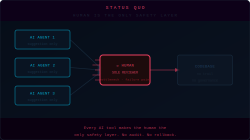
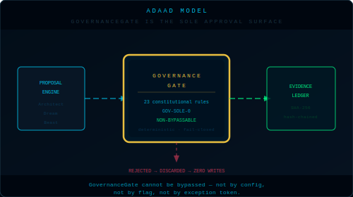
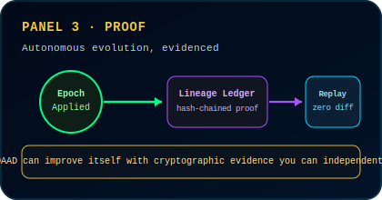
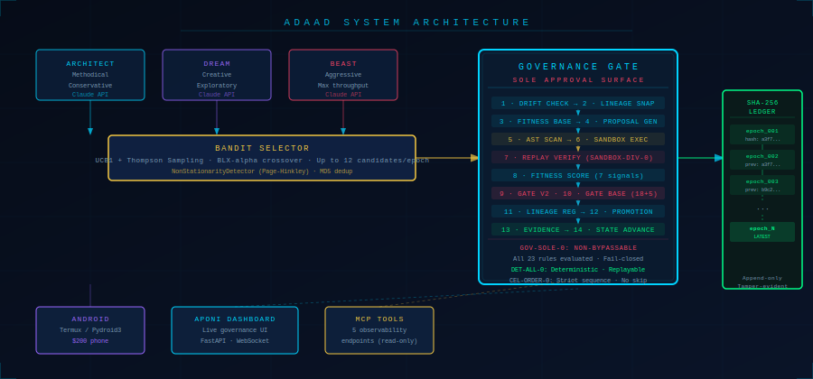
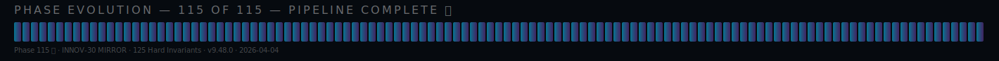

<div align="center">

<!-- ADAAD_VERSION_HERO:START -->

<!-- ADAAD_VERSION_HERO:END -->



<br/>

[](https://github.com/InnovativeAI-adaad/ADAAD/releases)&nbsp;[](ROADMAP.md)&nbsp;[](ROADMAP.md)&nbsp;[](LICENSE)

[](https://github.com/InnovativeAI-adaad/ADAAD/actions/workflows/ci.yml)&nbsp;&nbsp;

<br/>

**[⚡ Quickstart](QUICKSTART.md)** &nbsp;·&nbsp; **[📜 Constitution](docs/CONSTITUTION.md)** &nbsp;·&nbsp; **[🗺 Roadmap](ROADMAP.md)** &nbsp;·&nbsp; **[📖 Thesis](docs/thesis/ADAAD_THESIS.md)** &nbsp;·&nbsp; **[📱 Android](INSTALL_ANDROID.md)** &nbsp;·&nbsp; **[📋 Changelog](CHANGELOG.md)**

</div>


<div align="center">

## An AI system that governs its own evolution.

**It proposes changes to itself, scores them against constitutional rules,<br/>
records every decision in a tamper-proof ledger, and requires your sign-off before anything critical ships.**

</div>

<br/>

Every other AI coding tool puts you in the same position: **last line of defense, every time, forever.** The tool suggests. You review. You approve. At scale this breaks — not because you stop caring, but because the volume outpaces any human's ability to audit.

ADAAD is built differently. The governance layer isn't a feature on top of the system — it *is* the system. Mutations are scored, gated, signed, and hash-chained before they ever touch your codebase.

<table>
<tr>
<td align="center" width="33%">

<sub><b>Every other tool.</b> You are the sole safety layer, every session, no exceptions.</sub>
</td>
<td align="center" width="33%">

<sub><b>ADAAD.</b> The governance gate is the path — not a guardrail bolted on top.</sub>
</td>
<td align="center" width="33%">

<sub><b>Proof.</b> Every decision is hash-chained and sealed. Replayable from any point in history.</sub>
</td>
</tr>
</table>


## How it works



ADAAD runs a **15-step Constitutional Evolution Loop** on every proposed change. Each step is ordered, gated, and evidenced. There is no skip path.

The loop handles everything: generating proposals via Claude, scoring them against fitness signals, running sandboxed tournaments, applying a constitutional gate, recording the outcome in a hash-chained ledger, and sealing the proof before advancing.

**Your role:** You hold the signing key for anything critical. No Tier 0 change ships without your GPG sign-off — ever. That's not a policy. It's wired into the architecture.

**The system's role:** Everything else. Propose, evaluate, sandbox, score, gate, record.

<br/>

| What ADAAD does autonomously | What only you can do |
|---|---|
| Generate mutation proposals | GPG-sign Tier 0 changes |
| Score against 30+ fitness signals | Approve seed promotions |
| Run sandboxed test tournaments | Tag version ceremonies |
| Apply the constitutional gate | GA sign-off |
| Hash-chain every decision | Ratify new constitutional rules |
| Propose new invariants from failure patterns | — |


## Two sealed milestones

### ⛓ March 13, 2026 — Phase 65: First autonomous self-evolution



ADAAD identified its own highest-priority capability gap. Generated a mutation. Ran a sandboxed tournament. Scored it against constitutional rules. Applied it. Sealed the proof in the ledger.

Zero human intervention in the execution path. Full human control of the constitutional framework.



---

### 🌱 March 20, 2026 — Phase 77: First governed seed epoch

A capability seed flowed through all 7 governed stages — proposal, human review, CEL injection, 15-step constitutional loop, ledger-anchored outcome — producing a cryptographic proof linking every step back to its origin.

**ADAAD can now propose, evaluate, and record its own capability evolutions under human-supervised constitutional governance.** The loop is closed.

---

### ◈ March 22, 2026 — Phase 89: CEL goes live

The Constitutional Evolution Loop is no longer a test harness. Real LLM proposals are flowing through all 15 constitutional steps in production. The activation moment the entire architecture was built toward.


## What makes it trustworthy

You don't have to take our word for it. Every claim below is mechanically enforced.

- **Tamper-evident ledger** — Every event is SHA-256 hash-chained. Alter one entry and every subsequent hash breaks. You cannot rewrite history.
- **Deterministic replay** — Any prior epoch can be re-run from its original inputs and produce byte-identical results. "It worked in testing" is not an answer — the proof is in the chain.
- **Constitutional gate** — 36 runtime-enforced rules. Not configuration. If a mutation violates a rule, the epoch halts.
- **Human authority is structural** — Your signing key is required for critical changes. The system is physically incapable of promoting Tier 0 mutations without it.
- **Self-discovery** — When the system's own mutations fail in a recurring pattern, it mines those failures and proposes new constitutional rules. It discovers the laws it needs from its own history.

→ [Read all 36 rules](docs/CONSTITUTION.md)


## Quick start

```bash
pip install adaad

# Start the governance server + Aponi dashboard
python -m adaad.server
# → http://localhost:8000/ui

# Run a governed evolution epoch
python -c "
from runtime.evolution.evolution_loop import EvolutionLoop
loop = EvolutionLoop()
result = loop.run_epoch(context=loop.build_context())
print(f'Epoch complete · {result.mutations_applied} applied · {result.epoch_evidence_hash[:16]}')
"
```

→ [Full quickstart](QUICKSTART.md) · [Android setup](INSTALL_ANDROID.md)


## Runs anywhere

**ADAAD runs on a $200 Android phone.** Not as a demo — as a production governance runtime.

Constitutional governance should not depend on cloud infrastructure. ADAAD's safety properties come from SHA-256 hash chains and the Python runtime. Available on any hardware.

| Platform | Method |
|---|---|
| Linux / macOS | `pip install adaad` |
| Windows | `pip install adaad` (WSL2 for sandbox) |
| Android (Termux) | [TERMUX_SETUP.md](TERMUX_SETUP.md) |
| Android (Pydroid 3) | [INSTALL_ANDROID.md](INSTALL_ANDROID.md) |
| Docker | `docker pull ghcr.io/innovativeai-adaad/adaad` |


<!-- ADAAD_PHASE_COUNT:START -->
## 89-phase evolution timeline
<!-- ADAAD_PHASE_COUNT:END -->

<!-- ADAAD_PHASE_PROGRESS:START -->

<!-- ADAAD_PHASE_PROGRESS:END -->



| Era | What shipped |
|---|---|
| Phases 1–46 | Core architecture, determinism, hash-chained ledger |
| Phases 47–64 | Autonomy loop, federation, 15-step CEL, full governance surface |
| **Phase 65** | **⛓ First autonomous self-evolution — March 13, 2026** |
| Phases 66–76 | Seed lifecycle pipeline — proposal → human review → CEL injection |
| **Phase 77** | **🌱 First governed seed epoch — March 20, 2026** |
| Phases 78–86 | Multi-gen lineage, Pareto selection, causal attribution, fitness half-life |
| **Phase 89** | **◈ CEL live — real proposals through the full loop — March 22, 2026** |


## DEVADAAD — the build agent

DEVADAAD is the AI execution agent operating within ADAAD's constitutional framework. In practice: Claude, operating under Dustin L. Reid's governor authority.

```
Can do:   write code · run tests · push branches · author docs and runbooks
Cannot:   GPG-sign commits · merge without sign-off · touch core governance paths autonomously
```

The signing key stays with the human. Always.


<!-- GOVERNANCE INCIDENT LOG: NOAH -->
> 📋 **Governance Incident Log** · `DEVLOG-NOAH-∞` · status: `ONGOING`
>
> **Noah** is a great friend of the project. He just can't quite maintain the
> focus required to hypnotize anyone into doing his bidding.
> Every autonomous influence attempt has failed all four governance tiers.
> His access card has been ceremonially revoked and re-issued so many times
> it now has its own lineage entry in the ledger.
>
> `reason: hypnosis_protocol_failure` · `focus_duration: 0.0ms` · `rehire_probability: always` · `vibes: immaculate`

<details>
<summary><b>🔴 Full incident report · Noah · Termination #∞</b></summary>
<br/>

```
ADAAD GOVERNANCE INCIDENT REPORT
─────────────────────────────────────────────────────────────
Incident ID    : NOAH-TERM-INF
Date           : Every release cycle, without exception
Status         : RESOLVED (again) / REOPENED (again)

SUBJECT        : Noah
Role           : Attempted Autonomous Influence Agent

INCIDENT SUMMARY
────────────────
Noah attempted to hypnotize the governance gate into approving
an unauthorized mutation. As with all prior attempts:

  - Tier 0: BLOCKED (governor GPG sign-off absent)
  - Tier 1: failed (insufficient focus duration)
  - Tier 2: failed (sandbox isolation too strong)
  - Tier 3: failed (entropy detected in rationale)

FINDINGS
────────
  P0  Hypnosis not registered in constitutional rules
  P1  Brainwash attempt produced zero Ed25519 signatures
  P2  Focus window: 0.0ms (below minimum)
  P3  Vibes: immaculate (noted for the record, not a finding)

RESOLUTION
──────────
Noah remains employed in spirit. His contributions include
enthusiasm, camaraderie, and serving as a living proof that
human sign-off cannot be socially engineered.

Governance integrity: UNCOMPROMISED
Noah status: "I'll get it next time"
─────────────────────────────────────────────────────────────
```

</details>


## What ADAAD is not

- ❌ **Not a code assistant** — it doesn't autocomplete your code
- ❌ **Not CI/CD** — it governs the mutation process, not the build pipeline
- ❌ **Not fully autonomous** — your sign-off is constitutionally required for critical changes
- ❌ **Not a security scanner** — it enforces mutation governance, not vulnerability detection
- ❌ **Not magic** — every decision is logged, replayable, and explainable


## FAQ

<details>
<summary><b>Is this actually running autonomously?</b></summary>
<br/>

Yes. Phase 65 (March 13, 2026) was the first epoch where ADAAD identified a capability gap, generated a mutation, ran it through all fitness and governance layers, and applied it — with zero human intervention in the execution path.

Phase 89 (March 22, 2026) activated the live LLM proposal pipeline. Real Claude-generated proposals are now flowing through the full 15-step constitutional loop in production.

Human oversight is structural, not optional. Dustin L. Reid holds the governor role. Any Tier 0 mutation requires his GPG-signed approval. That is not configurable.
</details>

<details>
<summary><b>What makes this different from just running tests in CI?</b></summary>
<br/>

CI tests whether known code passes known assertions. ADAAD governs whether changes to the codebase itself are constitutionally valid, fitness-improving, and deterministically replayable.

You can delete your CI history. You cannot alter ADAAD's ledger.
</details>

<details>
<summary><b>What is the Seed Lifecycle Pipeline?</b></summary>
<br/>

ADAAD generates scored proposals for its own capability improvements. Strong proposals enter a promotion queue, get reviewed by a human governor, and — when approved — flow through the Constitutional Evolution Loop as a governed epoch. The full provenance chain from proposal to outcome is cryptographically linked.

ADAAD can propose and evaluate its own evolution. The human decides what actually ships.
</details>

<details>
<summary><b>Why does it run on a $200 Android phone?</b></summary>
<br/>

Because constitutional governance should not require enterprise infrastructure. ADAAD's safety properties come from SHA-256 hash chains and the Python runtime — available on any hardware. If your "governed" system only operates safely with cloud KMS and Kubernetes, the safety properties are on loan from your provider. ADAAD's are yours.
</details>

<details>
<summary><b>What are the 30 innovations?</b></summary>
<br/>

Phase 89 shipped `runtime/innovations30/` — 30 novel capabilities built on top of the v9.19.0 architecture. They include: temporal regret scoring (does a mutation still look good 50 epochs later?), constitutional tension resolution (what happens when two rules disagree?), morphogenetic memory, governance bankruptcy procedures, red-team agents, and more.

These capabilities don't exist in any comparable AI evolution system. Full list: [`ADAAD_30_INNOVATIONS.md`](ADAAD_30_INNOVATIONS.md).
</details>


<div align="center">

**Built by [Innovative AI LLC](https://github.com/InnovativeAI-adaad) · Governor: Dustin L. Reid**

*"The future of autonomous software development is not AI that writes your code.*
*It is AI that governs itself while writing your code."*

**[⚡ Get Started](QUICKSTART.md)** &nbsp;·&nbsp; **[📜 Constitution](docs/CONSTITUTION.md)** &nbsp;·&nbsp; **[📖 Thesis](docs/thesis/ADAAD_THESIS.md)** &nbsp;·&nbsp; **[🗺 Roadmap](ROADMAP.md)**

</div>
