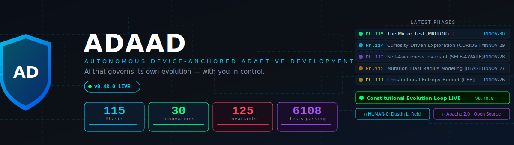
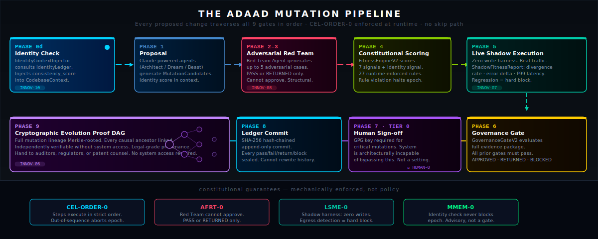

<div align="center">

<!-- ADAAD_VERSION_HERO:START -->

<!-- ADAAD_VERSION_HERO:END -->

**[⚡ Quickstart](#quickstart)** &nbsp;·&nbsp; **[📜 Constitution](docs/CONSTITUTION.md)** &nbsp;·&nbsp; **[🗺 Roadmap](ROADMAP.md)** &nbsp;·&nbsp; **[📖 Thesis](docs/thesis/ADAAD_THESIS.md)** &nbsp;·&nbsp; **[🏛 Trust Center](TRUST_CENTER.md)** &nbsp;·&nbsp; **[✅ Verifiable Claims](docs/VERIFIABLE_CLAIMS.md)** &nbsp;·&nbsp; **[📋 Changelog](CHANGELOG.md)**

</div>


## What ADAAD is

**ADAAD is a constitutionally governed autonomous code evolution runtime.**

It proposes mutations to its own source code, adversarially stress-tests them, scores them against constitutional rules, runs them in a zero-write shadow harness, checks them against a formally encoded self-model, and requires cryptographic sign-off before anything critical ships — with every decision sealed in a tamper-evident hash-chained ledger.

The governance stack is not a policy layer. It is the only promotion path. There is no bypass.

**Who it's for:** AI teams, research labs, and enterprises that need auditable, deterministic, human-governed autonomous code evolution — and need to prove it to auditors, regulators, or acquirers.


## Enforced guarantees

These are runtime-enforced invariants. Violating any one aborts the epoch.

| Guarantee | Mechanism | Invariant |
|:---|:---|:---:|
| Every epoch produces a verifiable evidence hash | SHA-256 hash-chained append-only ledger | `CEL-EVIDENCE-0` |
| Mutations are byte-identical replayable from original inputs | No `datetime.now()` or `random()` in constitutional paths | `CEL-REPLAY-0` |
| Pipeline step ordering cannot be bypassed | Runtime sequence check — out-of-order aborts immediately | `CEL-ORDER-0` |
| Governance gate is the sole promotion path | `GovernanceGateV2` is the only path — no side channel | `GOV-SOLE-0` |
| Shadow harness writes nothing to production | Zero-write enforcement + egress detection | `LSME-0` |
| Red Team agent cannot approve its own challenges | Structural constraint in code — PASS or RETURNED only | `AFRT-0` |
| Identity check never blocks an epoch | Fail-open with fallback score injection | `MMEM-0` |
| Critical mutations require GPG-signed human approval | Architecturally enforced — not a configuration option | `HUMAN-0` |
| Import boundaries block unauthorized dependencies | Static enforcement — violations block merge | `AST-IMPORT-0` |
| 162 Hard-class invariants enforced at runtime | Epoch aborts on any violation — no silent failures | 162 total |

→ [Full invariants matrix](docs/governance/V8_CONSTITUTIONAL_INVARIANTS_MATRIX.md) · [Constitution](docs/CONSTITUTION.md) · [Verifiable claims](docs/VERIFIABLE_CLAIMS.md)


## The pipeline



Every proposed change traverses all steps in strict order. There is no skip path, no override flag, no configuration that changes this.

<details>
<summary><b>Step-by-step breakdown</b></summary>
<br/>

**Step 0 — Identity check**
Before any proposal is generated, the `IdentityContextInjector` consults the `IdentityLedger` — a hash-chained, HUMAN-0-attested self-model. Injects `identity_consistency_score` into context. Proposals contradicting the system's self-model are flagged at the root. Never blocks the epoch.

**Step 1 — Proposal**
Claude-powered agents (Architect · Dream · Beast) generate mutation candidates. A bandit selector routes to the highest-performing agent based on prior epoch outcomes.

**Step 2–3 — Adversarial Red Team**
`AdversarialRedTeamAgent` finds code paths the proposing agent didn't cover, generates up to 5 adversarial cases, runs each in a read-only sandbox. Cannot approve — PASS or RETURNED only. Structural constraint, not policy.

**Step 4 — Constitutional scoring**
`FitnessEngineV2` scores against 8 signals including identity consistency. All 27 runtime-enforced constitutional rules checked. Rule violation halts the epoch immediately.

**Step 5 — Live shadow execution**
Zero-write shadow harness against real traffic patterns. Divergence rate, error delta, P99 latency. Regression on any signal is a hard block, independent of fitness score.

**Step 6 — Governance gate**
`GovernanceGateV2` evaluates the full evidence package. All prior gates must pass. Verdict: APPROVED · RETURNED · BLOCKED.

**Step 7 — Human sign-off (Tier 0)**
For critical mutations, GPG-signed approval from the governor is required. The system is architecturally incapable of promoting Tier 0 mutations without it.

**Step 8 — Ledger commit**
Every decision is SHA-256 hash-chained into the append-only scoring ledger. One altered entry breaks every subsequent hash.

**Step 9 — Cryptographic proof DAG**
Full mutation lineage Merkle-rooted. Every causal ancestor cryptographically linked. Independently verifiable without system access.

</details>


## Architecture


A **16-step Constitutional Evolution Loop (CEL)** runs on every proposed change. Three agents — **Architect** (structural reasoning), **Dream** (mutation generation), **Beast** (performance pressure) — apply constitutional rules at different steps. No single agent can approve a change.

<details>
<summary><b>Module map</b></summary>
<br/>

**Runtime layer** — `runtime/`

| Module | Role |
|:---|:---|
| `evolution/constitutional_evolution_loop.py` | 16-step CEL dispatch. Calls GovernanceGate, Red Team, shadow harness. |
| `evolution/fitness_v2.py` | `FitnessEngineV2` — 8-signal scoring including identity consistency. |
| `memory/identity_ledger.py` | Hash-chained HUMAN-0-gated self-model. |
| `memory/identity_context_injector.py` | Pre-proposal identity score injection. Never raises. |
| `lineage/lineage_ledger_v2.py` | Append-only ledger with chain verification. |
| `capability_graph.py` | Module capability contract tracking. |

**Governance layer** — `security/`

| Module | Role |
|:---|:---|
| `security/ledger/governance_events.jsonl` | Hash-chained HUMAN-0 sign-off events. |
| `security/ledger/scoring.jsonl` | All epoch governance decisions. Append-only. |
| `config/constitution.yaml` | 27 runtime-enforced constitutional rules. |

**Import boundaries:** All cross-layer imports must have an updated boundary contract. Violations block merge via `AST-IMPORT-0`. Every file must carry `# SPDX-License-Identifier: Apache-2.0`.

</details>


## Milestones

These events are sealed in the governance ledger.

<!-- AUTO-UPDATED: phase progress regenerates on every merge to main -->


<br/>

<details open>
<summary><b>⛓ March 13, 2026 — First autonomous self-evolution</b></summary>
<br/>


ADAAD identified its own highest-priority capability gap, generated a mutation, ran a sandboxed fitness tournament, scored it against constitutional rules, applied it, and sealed the proof in the ledger. Zero human intervention in the execution path. Full human control of the constitutional framework.


</details>

<details>
<summary><b>🌱 March 20, 2026 — First governed seed epoch</b></summary>
<br/>

A capability seed flowed through all 7 governed stages — proposal, human review, CEL injection, constitutional loop, ledger-anchored outcome — producing a cryptographic proof linking every step back to its origin.
</details>

<details>
<summary><b>◈ March 22, 2026 — Live LLM proposals in production</b></summary>
<br/>

Real Claude-generated proposals flowing through all 16 constitutional steps in production. Not a test harness.
</details>

<details>
<summary><b>🧭 March 23, 2026 — Cryptographic evolution proof DAG</b></summary>
<br/>

Every mutation cryptographically bound to all causal ancestors via Merkle root. Independently verifiable without system access.
</details>

<details>
<summary><b>🛡 March 24, 2026 — Zero-write shadow execution</b></summary>
<br/>

Zero-write shadow harness running against real traffic. Divergence rate, error delta, P99 latency. Must survive shadow execution and governance gate to advance.
</details>

<details>
<summary><b>⚔ March 27, 2026 — Adversarial Red Team as a constitutional gate</b></summary>
<br/>

Every proposal challenged by a dedicated adversarial agent before governance scoring. Finds uncovered code paths, fires targeted adversarial cases. Cannot approve — structurally enforced.
</details>

<details>
<summary><b>🎨 March 27, 2026 — Aesthetic fitness signal</b></summary>
<br/>

Code readability scored across 5 AST axes as a constitutionally-bounded, weighted fitness signal. Weight bounded [0.05, 0.30]. Technical debt is measurable and governed.
</details>

<details>
<summary><b>🧬 March 28, 2026 — Identity self-model</b></summary>
<br/>

A hash-chained, HUMAN-0-attested self-model. Before every epoch, an identity consistency score is injected into context. Proposals contradicting the system's self-model are flagged before they're written.
</details>

<details>
<summary><b>💭 March 30, 2026 — Cross-epoch mutation memory</b></summary>
<br/>

Between active epochs, the system replays successful past mutations in novel cross-epoch combinations to surface candidates not discoverable within a single epoch. Never touches production state — constitutionally enforced.
</details>

<details>
<summary><b>⚖️ April 1, 2026 — Constitutional jury system</b></summary>
<br/>

Contested mutations go to a 3-member jury of independent evaluators. No single agent can approve a contested promotion. Deliberation is deterministic from the mutation identifier — identical inputs produce identical verdicts, ledger-sealed.
</details>

<details>
<summary><b>🔍 April 3, 2026 — Self-model accuracy auditing</b></summary>
<br/>

Every 50 epochs, the system audits its own historical proposal accuracy against what it actually proposed. Low accuracy triggers a mandatory calibration epoch. The system corrects its own predictive self-model under constitutional constraint.
</details>

<details>
<summary><b>🔬 April 4, 2026 — Autonomous invariant discovery</b></summary>
<br/>

The system mines its own failure ledger for recurring violation patterns and proposes new constitutional invariants. Proposed invariants cannot self-promote — HUMAN-0 ratification is architecturally required.
</details>

<details>
<summary><b>⏮ April 4, 2026 — Constitutional rollback</b></summary>
<br/>

The constitution itself is versioned in a chain-linked snapshot ledger. Any prior constitutional state can be restored under HUMAN-0 gate. Governed forward evolution implies governed backward recovery.
</details>

<details>
<summary><b>🌐 April 4, 2026 — Federation governance consensus</b></summary>
<br/>

Federation-wide constitutional amendments require strict majority quorum — `floor(N/2)+1`. No single instance can amend federation-level invariants unilaterally.
</details>

<details>
<summary><b>🧠 April 4, 2026 — Self-proposing capability engine</b></summary>
<br/>

The system proposes its own next capabilities from failure signals, constitutional gap signals, and self-model accuracy signals. HUMAN-0 ratifies every proposal. The system identifies what it is missing and asks to be extended.
</details>

<details>
<summary><b>🔭 April 4, 2026 — External verification in under 60 seconds</b></summary>
<br/>

Any third party can clone the repository, run `docker compose up das-demo`, and independently verify a complete constitutional epoch — cryptographic chain intact, deterministic replay confirmed — without any knowledge of the codebase internals. Verification requires no trust in the operator.
</details>


## What you control vs. what the system handles

| You | ADAAD |
|:---|:---|
| GPG-sign critical changes | Generate mutation proposals |
| Approve capability seeds | Adversarially challenge every proposal before scoring |
| Set and amend constitutional rules | Shadow-execute mutations in zero-write harness |
| Tag version releases | Score against 27 constitutional rules |
| Ratify new invariants | Hash-chain every decision into the ledger |
| Amend the identity self-model | Consult self-model before every proposal |
| Patent and IP decisions | Build cryptographic evolution proof DAGs |
| GA sign-off | Mine failure patterns and propose new invariants |


<a name="quickstart"></a>
## Quickstart

```bash
git clone https://github.com/InnovativeAI-adaad/adaad.git
cd adaad
python onboard.py
```

```
  ✔ Python 3.12.x
  ✔ Virtual environment created (.venv)
  ✔ Dependencies installed
  ✔ Governance schemas valid
  ✔ Dry-run complete  (fail-closed behaviour confirmed)

  Run the dashboard   python server.py
  Run an epoch        python -m app.main --verbose
  Strict replay       python -m app.main --replay strict --verbose
```

**Verify independently (no ADAAD knowledge required):**

```bash
docker compose up das-demo      # run a full epoch
docker compose up das-verify    # verify HMAC chain
docker compose up das-replay    # confirm deterministic replay
```

<details>
<summary><b>Deterministic environment</b></summary>
<br/>

```bash
python3.12 -m venv .venv && source .venv/bin/activate
pip install -e .[dev]
export ADAAD_SEED=42 PYTHONHASHSEED=0
python -m app.main --replay audit --verbose
```

If your evidence hash differs: confirm Python minor version, `PYTHONHASHSEED=0`, deps without transitive upgrades.

</details>

<details>
<summary><b>Platform support</b></summary>
<br/>

| Platform | Method |
|:---|:---|
| Linux / macOS | `pip install adaad` or clone above |
| Windows | `pip install adaad` (WSL2 for sandbox) |
| Android (Termux) | [TERMUX_SETUP.md](TERMUX_SETUP.md) |
| Android (Pydroid 3) | [INSTALL_ANDROID.md](INSTALL_ANDROID.md) |
| Docker | `docker pull ghcr.io/innovativeai-adaad/adaad` |

</details>


## Replay and audit

```bash
# Standalone ledger chain verification
python scripts/verify_ledger.py artifacts/governance/phase121/das_ledger.jsonl

# Replay from stored ledger — must produce identical digest
python scripts/replay_epoch.py artifacts/governance/phase121/das_ledger.jsonl

# Inspect mutation lineage
python -c "
from runtime.lineage.lineage_ledger_v2 import LineageLedgerV2
ledger = LineageLedgerV2()
print('Chain valid:', ledger.verify_chain())
print('Events:', len(ledger.events()))
"
```


## Shipped capabilities

<details>
<summary><b>Full capability index — 36 modules</b></summary>
<br/>

Each module has 30 acceptance tests and a governance artifact. → [Claim→test→artifact→command](docs/VERIFIABLE_CLAIMS.md)

| Module | What it does | Invariant |
|:---|:---|:---:|
| Constitutional Self-Amendment | Proposes amendments to its own rules — HUMAN-0 ratification required | `CSAP-0` |
| Adversarial Constitutional Stress | Dedicated agent stress-tests every constitutional rule each epoch | `ACSE-0` |
| Temporal Invariant Forecasting | Predicts which invariants will be violated in future epochs before they fail | `TIFE-0` |
| Semantic Drift Detection | Detects constitutional behaviour drifting from historical baseline | `SCDD-0` |
| Autonomous Organ Emergence | Proposes new architectural organs to close capability gaps — HUMAN-0 required | `AOEP-0` |
| Cryptographic Evolution Proof DAG | Full mutation lineage Merkle-rooted; independently verifiable without system access | `CEPD-0` |
| Live Shadow Mutation Execution | Zero-write shadow harness; divergence regression is a hard block | `LSME-0` |
| Adversarial Fitness Red Team | Challenges every proposal before scoring; structurally cannot approve | `AFRT-0` |
| Aesthetic Fitness Signal | Code readability scored across 5 AST axes as a bounded fitness dimension | `AFIT-0` |
| Morphogenetic Memory | Hash-chained self-model consulted before every proposal; identity drift detected | `MMEM-0` |
| Cross-Epoch Dream State | Speculative mutation rehearsal across epoch boundaries; never touches production | `DSTE-0` |
| Mutation Genealogy | Full lineage graph for every mutation from proposal to terminal outcome | `MGV-0` |
| Inter-Agent Knowledge Transfer | Cryptographically verified signed capability transfer between agents | `IMT-0` |
| Constitutional Jury System | Multi-agent jury decides contested mutations; no single-agent approval | `CJS-0` |
| Agent Reputation Staking | Agents stake reputation on proposals; slashed on failure; chain-verified | `RST-0` |
| Emergent Role Specialization | Agents self-specialize into constitutional roles based on performance history | `ERS-0` |
| Agent Post-Mortem Interviews | Every terminated agent answers constitutional debrief before teardown | `APM-0` |
| Temporal Governance Windows | Health-adaptive rule severity; rules soften during high-health epochs | `GJR-0` |
| Governance Archaeology | Cryptographically verified decision timeline reconstruction for any mutation | `RST-0` |
| Constitutional Stress Testing | Adversarial scenario catalogue; gap ledger feeds invariant discovery | `BRM-0` |
| Governance Bankruptcy Protocol | Bounded bankruptcy state machine; discharge monotonic; re-entry blocked | `GBP-0` |
| Mutation Conflict Framework | Conflict detection; severity stratification; human escalation advisory | `MCF-0` |
| Constitutional Epoch Sentinel | Anticipatory warning before Hard-class invariant breach; fires before violation | `CES-0` |
| Sovereign Validation Plane | Independent constitutional validation outside the core pipeline | `SVP-0` |
| Hardware-Adaptive Fitness | Fitness scoring calibrated to available hardware resource envelope | `HAF-0` |
| Constitutional Entropy Budget | Rate-limits constitutional drift; 30% threshold triggers double human ratification | `GDA-0` |
| Regulatory Compliance Integration | Constitutional invariants traceable to external regulatory frameworks | `RCI-0` |
| Intent Preservation Verification | No mutation may reduce system self-monitoring observability | `IPV-0` |
| Curiosity-Driven Exploration | Inverted-fitness exploration every 25 epochs; hard stops prevent catastrophe | `CED-0` |
| Mirror Test | Historical proposal accuracy audit every 50 epochs; low accuracy triggers calibration | `MIRROR-0` |
| Invariant Discovery Engine | Autonomous invariant discovery from failure signals; HUMAN-0 ratification to promote | `IDE-0` |
| Constitutional Rollback Engine | Cryptographically governed rollback; HUMAN-0 gate; chain-verified reversal | `CRTV-0` |
| Knowledge Bundle Exchange | Cryptographically verified knowledge exchange across federation members | `KBEP-0` |
| Federation Governance Consensus | Constitutional amendments require strict majority quorum across federation | `FGCON-0` |
| Self-Proposing Capability Engine | System proposes its own next capabilities; HUMAN-0 ratification required | `SPIE-0` |
| Deterministic Audit Sandbox | Hermetic epoch sandbox; HMAC chain; external verification in under 60 seconds | `DAS-0` |

</details>


## For contributors

```bash
pytest --tb=short -q
python scripts/check_spdx_headers.py
python scripts/check_dependency_baseline.py
python -m app.main --replay audit --verbose
```

Every governance-impacting PR requires: a `feature/` or `fix/` branch, new test count, any new invariants, an evidence hash from a local epoch run, and HUMAN-0 sign-off before merge.

→ [CONTRIBUTING.md](CONTRIBUTING.md) · [Constitution](docs/CONSTITUTION.md) · [Invariants matrix](docs/governance/V8_CONSTITUTIONAL_INVARIANTS_MATRIX.md)


## Security

**SPDX enforcement** — Every source file carries `# SPDX-License-Identifier: Apache-2.0`. Missing headers block merge.

**Import boundaries** — Cross-layer imports without an updated boundary contract block merge via `AST-IMPORT-0`.

**Replay divergence** — Any divergence from expected evidence hash is a blocking integrity signal.

**Key management** — HUMAN-0 GPG key (`4C95E2F99A775335B1CF3DAF247B015A1CCD95F6`) signs all release tags and Tier 0 governance events. Not stored in this repository.

→ [Trust Center](TRUST_CENTER.md) · Report vulnerabilities via [SECURITY.md](SECURITY.md) — not public issues.


## Live stats

<!-- AUTO-UPDATED: stats card regenerates on every merge to main -->


<div align="center">

&nbsp;&nbsp;&nbsp;

</div>


## Runtime roles

| Name | Role |
|:---|:---|
| **Architect** | Structural mutation agent. Maintainability and constitutional alignment. |
| **Dream** | Exploratory mutation agent. Novel approaches, capability gap identification. |
| **Beast** | Performance mutation agent. Throughput, efficiency, bottleneck pressure. |
| **Cryovant** | Identity and device-anchoring layer. Session tokens, audit signatures. |
| **Aponi** | Governance dashboard. Audit UI, mutation lineage viewer, live epoch status. |
| **HUMAN-0** | The governor. Dustin L. Reid. Holds GPG key. Ratifies constitutional changes. |


## Enterprise

| Resource | What it is |
|:---|:---|
| [Procurement Fast-Lane](docs/commercial/procurement_fastlane/DAY0_PROCUREMENT_FASTLANE_CHECKLIST.md) | Day-0 checklist, DPA/MSA clauses, security Q&A — designed for 5-day close |
| [SLO / SLA Sheet](docs/commercial/procurement_fastlane/SLA_SLO_SHEET.md) | Reliability targets and support tier commitments |
| [Compliance Pack](docs/compliance/) | Data handling, access control matrix, incident response |
| [Trust Center](TRUST_CENTER.md) | Security posture and governance assurance artifacts |
| [Certification Program](docs/training/CERTIFICATION_PROGRAM.md) | Operator · Governance Engineer · Enterprise Administrator |


## What ADAAD is not

- **Not a code assistant** — doesn't autocomplete or answer questions
- **Not CI/CD** — governs the mutation process, not the build pipeline
- **Not fully autonomous** — your sign-off is constitutionally required for critical changes
- **Not a security scanner** — enforces mutation governance, not vulnerability detection
- **Not opaque** — every decision is logged, hash-chained, replayable, and explainable


## FAQ

<details>
<summary><b>Is this actually running autonomously?</b></summary>
<br/>

Yes. The first epoch where ADAAD identified a capability gap, generated a mutation, ran it through all fitness and governance layers, and applied it with zero human intervention in the execution path was March 13, 2026. Live LLM proposals in production followed March 22, 2026.

Human oversight is structural. The governor holds a GPG key. Any critical mutation requires cryptographic sign-off. That is not configurable.
</details>

<details>
<summary><b>What makes this different from running tests in CI?</b></summary>
<br/>

CI tests whether known code passes known assertions. ADAAD governs whether *changes to the codebase itself* are constitutionally valid, adversarially stress-tested, fitness-improving, and deterministically replayable.

You can delete CI history. You cannot alter the ADAAD ledger without breaking every subsequent hash.

ADAAD actively challenges its own proposals via an adversarial agent, checks them against a formally encoded self-model, and runs them through zero-write shadow execution before they reach production. It produces a cryptographic proof of evolutionary lineage.
</details>

<details>
<summary><b>How does adversarial red-teaming work?</b></summary>
<br/>

Every mutation proposal is handed to `AdversarialRedTeamAgent` before fitness scoring. It finds code paths the proposing agent didn't cover and generates up to five targeted adversarial cases. Each runs in a read-only sandbox.

If any case falsifies the proposal, it's returned with a findings report. The agent cannot approve — structurally enforced in code, not policy.
</details>

<details>
<summary><b>What is the identity self-model?</b></summary>
<br/>

A hash-chained, HUMAN-0-attested, append-only ledger containing founding statements about what ADAAD believes itself to be. Before every epoch's proposals are generated, an identity consistency score is injected into context for all downstream stages.

It answers the question no prior gate could ask: *is this mutation consistent with what this system believes itself to be?*
</details>


## Roadmap

Post-pipeline focus: Verifiability → Credibility → Adoptability → Sustainability.

Active GA blocker: `FINDING-66-004` — Governance Key Ceremony (HUMAN-0 action required).

Next: CLI entry point (`adaad demo` · `adaad inspect-ledger`), `adaad-core` as a standalone importable package, community governance infrastructure.

→ [Full roadmap](ROADMAP.md) · [Post-pipeline strategic plan](docs/governance/POST_PIPELINE_STRATEGIC_PLAN.md) · [Verifiable claims](docs/VERIFIABLE_CLAIMS.md)


<div align="center">


<br/><br/>

**Built by [Innovative AI LLC](https://github.com/InnovativeAI-adaad) · Governor: Dustin L. Reid · Blackwell, Oklahoma**

*The next wave of AI isn't AI that writes your code.*
*It's AI that governs itself while writing your code —*
*and can prove it.*

<br/>

**[⚡ Get Started](#quickstart)** &nbsp;·&nbsp; **[📜 Constitution](docs/CONSTITUTION.md)** &nbsp;·&nbsp; **[🏛 Trust Center](TRUST_CENTER.md)** &nbsp;·&nbsp; **[✅ Verifiable Claims](docs/VERIFIABLE_CLAIMS.md)**

<br/>

*Build without limits. Govern without compromise.*

</div>
