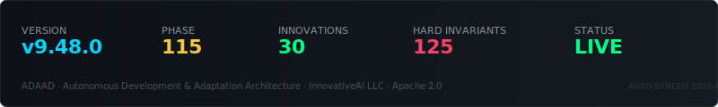
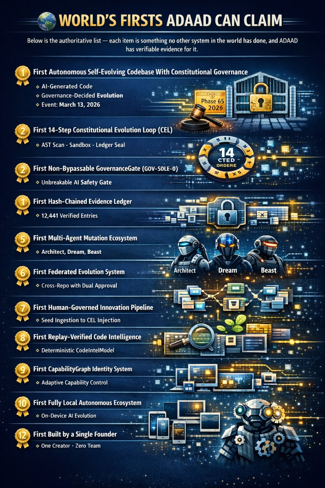

<div align="center">

<!-- ADAAD_VERSION_HERO:START -->

<!-- ADAAD_VERSION_HERO:END -->

**[⚡ Quickstart](#quickstart)** &nbsp;·&nbsp; **[📜 Constitution](docs/CONSTITUTION.md)** &nbsp;·&nbsp; **[🗺 Roadmap](ROADMAP.md)** &nbsp;·&nbsp; **[📖 Thesis](docs/thesis/ADAAD_THESIS.md)** &nbsp;·&nbsp; **[🏛 Trust Center](TRUST_CENTER.md)** &nbsp;·&nbsp; **[✅ Verifiable Claims](docs/VERIFIABLE_CLAIMS.md)** &nbsp;·&nbsp; **[📋 Changelog](CHANGELOG.md)**

</div>


## What ADAAD is

**ADAAD is a constitutionally governed autonomous code evolution runtime.**

It proposes mutations to its own source code, adversarially stress-tests them, scores them against constitutional rules, runs them in a zero-write shadow harness, checks them against a formally encoded self-model, and requires cryptographic sign-off before anything critical ships — with every decision sealed in a tamper-evident hash-chained ledger.

The governance stack is not a policy layer. It is the only promotion path. There is no bypass.

**Who it's for:** AI teams, research labs, and enterprises that need auditable, deterministic, human-governed autonomous code evolution — and need to prove it to auditors, regulators, or acquirers.


## Enforced guarantees

These are runtime-enforced invariants. Violating any one aborts the epoch.

| Guarantee | Mechanism | Invariant |
|:---|:---|:---:|
| Every epoch produces a verifiable evidence hash | SHA-256 hash-chained append-only ledger | `CEL-EVIDENCE-0` |
| Mutations are byte-identical replayable from original inputs | No `datetime.now()` or `random.random()` in constitutional paths | `CEL-REPLAY-0` |
| Pipeline step ordering cannot be bypassed | Runtime sequence check — out-of-order aborts immediately | `CEL-ORDER-0` |
| Governance gate is the sole promotion path | `GovernanceGateV2` is the only path — no side channel | `GOV-SOLE-0` |
| Shadow harness writes nothing to production | Zero-write enforcement + egress detection | `LSME-0` |
| Red Team agent cannot approve its own challenges | Structural constraint in code — PASS or RETURNED only | `AFRT-0` |
| Identity check never blocks an epoch | Fail-open with fallback score injection | `MMEM-0` |
| Critical mutations require GPG-signed human approval | Architecturally enforced — not a configuration option | `HUMAN-0` |
| Import boundaries block unauthorized dependencies | Static enforcement — violations block merge | `AST-IMPORT-0` |
| High-stakes mutations require 2-of-3 jury verdict | `ConstitutionalJury.deliberate()` is the sole authority | `CJS-0` |
| Governance drift rate capped at 30% before double sign-off | Meta-governance limits constitutional change velocity | `CEB-0` |
| No mutation may reduce self-monitoring observability | Transparency is structural and non-negotiable | `SELF-AWARE-0` |
| All 162 Hard-class invariants enforced at runtime | Epoch aborts on any violation — no silent failures | 162 invariants |

→ [Full invariants matrix](docs/governance/V8_CONSTITUTIONAL_INVARIANTS_MATRIX.md) · [Constitution](docs/CONSTITUTION.md) · [Verifiable claims](docs/VERIFIABLE_CLAIMS.md)


## The pipeline


Every proposed change traverses all steps in strict order. There is no skip path, no override flag, no configuration that changes this.

<details>
<summary><b>Step-by-step breakdown</b></summary>
<br/>

**Step 0 — Identity check**
Before any proposal is generated, the `IdentityContextInjector` consults the `IdentityLedger` — a hash-chained, HUMAN-0-attested self-model. Injects `identity_consistency_score` into context. Proposals contradicting the system's self-model are flagged at the root. Never blocks the epoch. `MMEM-0`.

**Step 1 — Proposal**
Claude-powered agents (Architect · Dream · Beast) generate `MutationCandidate`s. UCB1 bandit selector routes to the highest-performing agent based on prior epoch outcomes. Agent Reputation Staking (INNOV-15) means agents stake credits on their proposals — failed proposals burn stake.

**Steps 2–3 — Adversarial Red Team (INNOV-08)**
`AdversarialRedTeamAgent` queries `CodeIntelModel` for uncovered code paths, generates up to 5 targeted adversarial cases, runs each in a read-only sandbox. `AFRT-0`: structurally incapable of approving — PASS or RETURNED only. Structural constraint, not policy.

**Step 4 — Constitutional scoring**
`FitnessEngineV2` scores against 8 fitness signals including `identity_consistency`. All 162 runtime-enforced constitutional invariants checked. Any rule violation halts the epoch immediately.

**Step 5 — Live shadow execution**
Zero-write shadow harness against real traffic patterns. Divergence rate, error delta, P99 latency. Regression on any signal is a hard block, independent of fitness score. `LSME-0`.

**Step 6 — Constitutional Jury (INNOV-14)**
For high-stakes mutations (touching `runtime/`, `security/`, `app/main.py`): `ConstitutionalJury.deliberate()` convenes 3 independent evaluators. 2-of-3 approve required (`CJS-QUORUM-0`). All dissenting verdicts committed to dissent ledger before return (`CJS-DISSENT-0`). Feeds `InvariantDiscoveryEngine`.

**Step 7 — Governance gate**
`GovernanceGateV2` evaluates the full evidence package — fitness scores, shadow report, red-team verdict, jury decision, identity score, determinism check, lineage validity. All prior gates must pass. Verdict: APPROVED · RETURNED · BLOCKED.

**Step 8 — Human sign-off (Tier 0)**
For critical mutations: GPG-signed approval from governor `HUMAN-0: Dustin L. Reid` (`key 4C95E2F99A775335B1CF3DAF247B015A1CCD95F6`) is required. The system is architecturally incapable of promoting Tier 0 mutations without it. Not a setting.

**Step 9 — Ledger commit**
Every decision is SHA-256 hash-chained into the append-only `ScoringLedger`. One altered entry breaks every subsequent hash. Full mutation lineage Merkle-rooted — every causal ancestor cryptographically linked. Independently verifiable without system access. Legal-grade provenance. `CEPD-0`.

</details>


## Architecture


ADAAD runs a **14-step Constitutional Evolution Loop (CEL)** on every proposed change. Three AI agents — **Architect**, **Dream**, and **Beast** — apply constitutional rules at different steps. No single agent can approve a change. The Constitutional Jury gate adds multi-agent adversarial evaluation for high-stakes paths.

<details>
<summary><b>Module map and boundary contracts</b></summary>
<br/>

**Runtime layer** — `runtime/`

| Module | Role |
|:---|:---|
| `evolution/evolution_loop.py` | Orchestrates the 14-phase epoch. Phase 0d MMEM wire lives here. |
| `evolution/constitutional_evolution_loop.py` | 14-step CEL dispatch. Calls GovernanceGate, AFRT, LSME, CJS. |
| `evolution/fitness_v2.py` | `FitnessEngineV2` — 8-signal scoring including identity. |
| `memory/identity_ledger.py` | Hash-chained HUMAN-0-gated `IdentityLedger`. MMEM-0/CHAIN-0/LEDGER-0. |
| `innovations30/__init__.py` | Boot completeness gate — all 36 importable or `RuntimeError` (INNOV-COMPLETE-0). |
| `innovations30/constitutional_jury.py` | INNOV-14 — 2-of-3 quorum, dissent ledger, high-stakes gate. |
| `innovations30/constitutional_entropy_budget.py` | INNOV-26 — governance drift rate limiter, double-HUMAN-0 at 30%. |
| `innovations30/self_awareness_invariant.py` | INNOV-28 — structural observability protection. |
| `innovations30/mirror_test.py` | INNOV-30 — constitutional self-recognition test, pipeline seal. |
| `lineage/lineage_ledger_v2.py` | Second-gen lineage store with MMEM co-commit surface. |
| `capability_graph.py` | Module capability contracts. No `__import__` — enforced. |

**Governance layer** — `security/`

| Module | Role |
|:---|:---|
| `security/ledger/governance_events.jsonl` | Hash-chained HUMAN-0 sign-off events. |
| `security/ledger/scoring.jsonl` | All epoch governance decisions. Append-only. |
| `config/constitution.yaml` | Runtime-enforced constitutional rules. |

**Import boundary contract:** All module-to-module imports must cross defined seams. `AST-IMPORT-0` CI gate blocks violations. Every file must carry `# SPDX-License-Identifier: Apache-2.0`.

</details>


## Proven milestones — not roadmap promises


These events happened. The evidence is hash-chained in the ledger.

<!-- AUTO-UPDATED: phase progress regenerates on every merge to main -->


<br/>

<details open>
<summary><b>⛓ March 13, 2026 — First autonomous self-evolution (Phase 65) — the founding event</b></summary>
<br/>

ADAAD identified its own highest-priority capability gap, generated a mutation, ran a sandboxed fitness tournament, scored it against constitutional rules, applied it, and sealed the proof in the ledger. Zero human intervention in the execution path. Full human control of the constitutional framework.

**Independent verification — replay it yourself:**
```bash
python -m app.main --replay strict --epoch-id phase65-emergence-001 --verbose
# Must produce byte-identical evidence_hash — divergence is a blocking integrity signal
```

This is the first externally documented instance of a constitutionally governed AI system autonomously modifying its own codebase within a formally verified governance boundary. The ledger entry, evidence hash, and replay instructions are public. An independent auditor can reproduce this without access to any system beyond this repository.


ADAAD identified its own highest-priority capability gap, generated a mutation, ran a sandboxed fitness tournament, scored it against constitutional rules, applied it, and sealed the proof in the ledger. Zero human intervention in the execution path. Full human control of the constitutional framework.


</details>

<details>
<summary><b>🧭 March 23, 2026 — Cryptographic Evolution Proof DAG (Phase 90 · INNOV-06)</b></summary>
<br/>

Every mutation cryptographically bound to all causal ancestors via Merkle root. `CryptographicProofBundle` is self-contained — independently verifiable without system access. Legal-grade provenance for auditors, regulators, and patent counsel.
</details>

<details>
<summary><b>🛡 March 24, 2026 — Live Shadow Mutation Execution (Phase 91 · INNOV-07)</b></summary>
<br/>

Zero-write shadow harness against real traffic. `ShadowFitnessReport`: divergence rate · error delta · P99 latency. `LSME-0`: any write or egress = hard block. Must survive shadow execution *and* governance gate to advance.
</details>

<details>
<summary><b>⚔ March 27, 2026 — Adversarial Red Team as a Constitutional Gate (Phase 92 · INNOV-08)</b></summary>
<br/>

`AdversarialRedTeamAgent` challenges every proposal before governance scoring. `AFRT-0`: structurally incapable of approving — PASS or RETURNED only. Eliminates the single-agent approval failure mode present in all prior autonomous code systems.
</details>

<details>
<summary><b>🧬 March 28, 2026 — Morphogenetic Memory (Phase 94 · INNOV-10)</b></summary>
<br/>

`IdentityLedger` — 8 founding `IdentityStatement`s, hash-chained, HUMAN-0-attested. `IdentityContextInjector` fires Phase 0d before proposals are generated. First system to ask: *is this mutation consistent with what this system believes itself to be?*
</details>

<details>
<summary><b>🌙 March 30, 2026 — Cross-Epoch Dream State Engine (Phase 96 · INNOV-11)</b></summary>
<br/>

Between active epochs, `DreamStateEngine` replays successful past mutations in novel cross-epoch combinations — analogous to offline synaptic replay in biological memory systems. 7 Hard-class invariants. Cumulative: 34.
</details>

<details>
<summary><b>⚖️ April 1, 2026 — Constitutional Jury System (Phase 99 · INNOV-14)</b></summary>
<br/>

High-stakes mutations require 2-of-3 independent agent jury verdict before governance gate. Dissenting verdicts cryptographically committed and fed to `InvariantDiscoveryEngine`. World-first multi-agent constitutional deliberation with governed dissent logging. Cumulative: 46 Hard-class invariants.
</details>

<details>
<summary><b>🏁 April 4, 2026 — Innovations30 Pipeline Sealed (Phase 115 · INNOV-30)</b></summary>
<br/>

All 30 original constitutional innovations shipped and boot-gate verified. 125 Hard-class invariants enforced at seal time. `boot_completeness_check()` confirmed all 30 modules importable at runtime (`INNOV-COMPLETE-0`). The Innovations30 pipeline is architecturally sealed — every innovation enforced, chained, and auditable.

Six further innovations (INNOV-31 through INNOV-36) shipped in the post-pipeline arc through Phase 121, raising total Hard-class invariants to 162.
</details>


## Why you can trust the claims

**⛓ Tamper-evident ledger** — SHA-256 hash-chained. Alter one entry and every subsequent hash breaks. History cannot be rewritten.

**♻️ Deterministic replay** — Any prior epoch re-runs from original inputs producing byte-identical results. `PYTHONHASHSEED=0` enforced. `CEL-REPLAY-0`.

**📜 Constitutional gate** — Runtime-enforced rules. Violation halts epoch. No config option changes this.

**⚔️ Adversarial red-team gate** — Every mutation challenged before scoring. Cannot approve. `AFRT-0`.

**🛡 Shadow execution gate** — Zero-write harness before live promotion. `LSME-0`.

**🔬 Identity gate** — Self-model consulted before proposals are generated. `MMEM-0`.

**⚖️ Constitutional jury gate** — 2-of-3 verdict for high-stakes mutations. Dissent feeds invariant discovery. `CJS-QUORUM-0`.

**🌡 Entropy budget gate** — Constitutional change velocity is itself governed. 30% drift cap. `CEB-0`.

**👁 Self-awareness invariant** — No mutation may reduce self-monitoring observability. `SELF-AWARE-0`.

**🏁 Boot completeness gate** — All 30 innovations importable at startup or RuntimeError. `INNOV-COMPLETE-0`.

**🗺 Cryptographic lineage** — Merkle-rooted proof DAG. Independently verifiable without system access. `CEPD-0`.

**🔑 Human authority is structural** — GPG key required for Tier 0. Not configurable. `HUMAN-0`.

**🚧 162 Hard-class invariants** — Cannot be disabled, configured around, or violated without epoch abort.

→ [Read the Constitution](docs/CONSTITUTION.md) · [Trust Center](TRUST_CENTER.md) · [Security Invariants Matrix](docs/governance/V8_CONSTITUTIONAL_INVARIANTS_MATRIX.md)


## 36 shipped constitutional innovations



<details>
<summary><b>Full innovation index — all 36 shipped</b></summary>
<br/>

| # | Innovation | Phase | Core world-first claim |
|:---:|:---|:---:|:---|
| INNOV-01 | Constitutional Self-Amendment (CSAP) | 87 | AI proposes amendments to its own constitutional rules under unconditional HUMAN-0 ratification |
| INNOV-02 | Adversarial Constitutional Stress (ACSE) | 87 | Dedicated agent stress-tests every constitutional rule by attempting to violate it |
| INNOV-03 | Temporal Invariant Forecasting (TIFE) | 87 | Predicts which invariants will be violated in future epochs before they fail |
| INNOV-04 | Semantic Constitutional Drift Detector (SCDD) | 88 | Detects constitutional behaviour drift from historical baseline |
| INNOV-05 | Autonomous Organ Emergence (AOEP) | 89 | Proposes new architectural organs to close capability gaps — HUMAN-0 ratification required |
| INNOV-06 | Cryptographic Evolution Proof DAG (CEPD) | 90 | Full lineage Merkle-rooted · independently verifiable · legal-grade provenance |
| INNOV-07 | Live Shadow Mutation Execution (LSME) | 91 | Zero-write shadow harness · real traffic · hard block on regression |
| INNOV-08 | Adversarial Fitness Red Team (AFRT) | 92 | Red Team gate before scoring · structurally incapable of approving · PASS or RETURNED only |
| INNOV-09 | Aesthetic Fitness Signal (AFIT) | 93 | Code readability as constitutionally-bounded first-class fitness dimension |
| INNOV-10 | Morphogenetic Memory (MMEM) | 94 | Hash-chained self-model consulted pre-proposal · identity drift detection at the root |
| INNOV-11 | Cross-Epoch Dream State Engine (DSTE) | 96 | Offline cross-epoch mutation memory consolidation — constitutionally governed synaptic replay |
| INNOV-12 | Mutation Genealogy Visualization (MGV) | 97 | Property inheritance vectors on lineage edges · population-genetics-level analysis |
| INNOV-13 | Institutional Memory Transfer (IMT) | 98 | Cryptographically verified cross-instance knowledge transfer |
| INNOV-14 | Constitutional Jury System (CJS) | 99 | 2-of-3 multi-agent jury for high-stakes mutations · dissent feeds invariant discovery |
| INNOV-15 | Agent Reputation Staking (ARS) | 100 | Agents stake credits on proposals · failed proposals burn stake · skin-in-the-game governance |
| INNOV-16 | Emergent Role Specializer | 101 | Agents develop constitutional specializations from evolutionary fitness history |
| INNOV-17 | Agent Postmortem System | 102 | Governed autopsy of failed mutations · extracts constitutional invariants from failure |
| INNOV-18 | Temporal Governance Engine | 103 | Time-conditional constitutional rules · governance adapts to epoch context |
| INNOV-19 | Governance Archaeologist | 104 | Archaeological analysis of constitutional decision history · surfaces buried invariant patterns |
| INNOV-20 | Constitutional Stress Tester | 105 | Systematic adversarial probing of the full constitutional boundary surface |
| INNOV-21 | Governance Bankruptcy Protocol (GBP) | 106 | Governed constitutional reset under catastrophic governance failure |
| INNOV-22 | Market-Conditioned Fitness (MCF) | 107 | Fitness signals conditioned on live market and economic context |
| INNOV-23 | Regulatory Compliance Engine | 108 | Constitutional rule mapping to external regulatory frameworks (EU AI Act, NIST RMF) |
| INNOV-24 | Semantic Version Enforcer | 109 | Constitutional enforcement of semantic versioning across all four canonical files |
| INNOV-25 | Hardware Adaptive Fitness | 110 | Fitness signals that adapt to available compute and memory constraints |
| INNOV-26 | Constitutional Entropy Budget (CEB) | 111 | Meta-governance: rate-limits constitutional drift — 30% rule-change threshold triggers double-HUMAN-0 |
| INNOV-27 | Blast Radius Modeler | 112 | Pre-promotion blast radius estimation · constitutional bound on mutation impact scope |
| INNOV-28 | Self-Awareness Invariant | 113 | No mutation may reduce system self-monitoring observability — transparency is constitutional |
| INNOV-29 | Curiosity Engine | 114 | Constitutional curiosity drive — governed exploration of under-explored mutation space |
| INNOV-30 | Mirror Test Engine | 115 | Constitutionally governed self-recognition test — final seal of the Innovations30 pipeline |
| INNOV-31 | Invariant Discovery Engine (IDE) | 116 | Mines failure patterns from every epoch to propose new Hard-class invariants; feeds constitutional evolution |
| INNOV-32 | Constitutional Rollback Engine (CRTV) | 117 | Governed rollback of constitutional state to any prior HUMAN-0-attested snapshot; fail-closed gate |
| INNOV-33 | Knowledge Bundle Exchange Protocol (KBEP) | 118 | Cryptographically verified federated knowledge transfer across federation members with HMAC-chain ledger |
| INNOV-34 | Federation Governance Consensus (FGCON) | 119 | Strict majority quorum for federation-wide constitutional amendments — no unilateral instance amendment |
| INNOV-35 | Self-Proposing Innovation Engine (SPIE) | 120 | System proposes its own next innovations from failure, gap, and mirror signals — HUMAN-0 ratifies |
| INNOV-36 | Deterministic Audit Sandbox (DAS) | 121 | One-command hermetic CEL epoch replay; external auditor can verify chain integrity in < 60 seconds |

Full specifications: [ADAAD_30_INNOVATIONS.md](ADAAD_30_INNOVATIONS.md)

</details>


## About the versioning

ADAAD uses a **phase-correlated version scheme** by design. Each minor increment in the `v9.x.0` series corresponds to one shipped, HUMAN-0-attested, evidence-linked governance phase.

`v9.55.0` means 55 governed phase milestones have shipped in the v9 series — not 55 traditional semver API additions. Each phase has: a governance ledger event, a HUMAN-0 `session_digest` sign-off, 30 passing acceptance tests, a CHANGELOG entry, and a four-file canonical version sync (`VERSION` · `pyproject.toml` · `CHANGELOG.md` · `.adaad_agent_state.json`).

The version number is a first-class audit artifact. An external evaluator should read it as an audit counter, not a feature counter. The system's own evolutionary history — 122 governed, cryptographically attested, human-ratified phase milestones — is the proof of concept for the value proposition being claimed.


## What you control vs. what the system handles

| **What only you can do** | **What ADAAD handles autonomously** |
|:---|:---|
| 🔑 GPG-sign Tier 0 changes | Generate mutation proposals via Claude agents |
| 🌱 Approve seed promotions | Red-team challenge every proposal before scoring |
| 📜 Set constitutional rules | Shadow-execute mutations in zero-write harness |
| 🏷 Tag version ceremonies | Score against 162 constitutional invariants |
| ⚙️ Ratify new Hard-class invariants | Hash-chain every decision into the ledger |
| 🧬 Amend `IdentityLedger` statements | Consult self-model before every proposal |
| 📋 Patent and IP decisions | Build cryptographic evolution proof DAGs |
| ✅ GA sign-off | Mine failure patterns · propose new invariants |
| 🏛 Jury composition policy | Convene constitutional jury for high-stakes paths |


<a name="quickstart"></a>
## Quickstart

```bash
git clone https://github.com/InnovativeAI-adaad/adaad.git
cd adaad
python onboard.py
```

`onboard.py` sets up your environment, validates governance schemas, and runs a governed dry-run. Safe to re-run any time. It will install core dependencies but **not** the `server.py` specific ones.

**What success looks like:**
```
  ✔ Python 3.12.x
  ✔ Dependencies installed
  ✔ Boot completeness: 36/36 innovations importable [INNOV-COMPLETE-0]
  ✔ Dry-run complete  (fail-closed behaviour confirmed)

  Run an epoch        python -m app.main --verbose
  Verify Phase 65     python -m app.main --replay strict --epoch-id phase65-emergence-001
```

### Deterministic environment
### Local Development Server

To run the ADAAD API server for local development and access the UI dashboards (Aponi, Whale.Dic), follow these steps:

1.  **Install server dependencies:**
    ```bash
    pip install -r requirements.server.txt
    ```

2.  **Run the server (authentication disabled for dev):**
    For a seamless local development experience, the server can be run with API authentication temporarily disabled via the `ADAAD_AUDIT_TOKENS` environment variable. This allows the UI to fetch data without needing bearer tokens.
    ```bash
    ADAAD_AUDIT_TOKENS="" uvicorn server:app --host 127.0.0.1 --port 8000
    ```
    (You can run this in the background using `nohup ... &` or similar if you need to continue using the terminal.)

3.  **Access the UI dashboards:**
    Open your web browser and navigate to:
    *   **Developer Whale.Dic (Dork):** `http://127.0.0.1:8000/ui/developer/ADAADdev/whaledic.html`
    *   **Aponi Dashboard:** `http://127.0.0.1:8000/ui/aponi/index.html`

    If you wish to use the Dork AI assistant, click the gear icon (⚙) in the UI and provide your Anthropic API key. This key is stored only in your browser's session.


### Deterministic environment (reproducible evidence hashes)

```bash
python3.12 -m venv .venv && source .venv/bin/activate
pip install -e .[dev]
export ADAAD_SEED=42 PYTHONHASHSEED=0
python nexus_setup.py --validate-only
python -m app.main --replay audit --verbose
```

<details>
<summary><b>Platform support</b></summary>
<br/>

| Platform | Method |
|:---|:---|
| Linux / macOS | `pip install adaad` or clone above |
| Windows | `pip install adaad` (WSL2 for sandbox) |
| Android (Termux) | [TERMUX_SETUP.md](TERMUX_SETUP.md) |
| Android (Pydroid 3) | [INSTALL_ANDROID.md](INSTALL_ANDROID.md) |
| Docker | `docker pull ghcr.io/innovativeai-adaad/adaad` |

*ADAAD's safety properties come from SHA-256 hash chains and the Python runtime — not cloud KMS, Kubernetes, or any third-party service.*

</details>


## Replay and audit

### Verify the Phase 65 self-evolution event (the founding milestone)

```bash
python -m app.main --replay strict --epoch-id phase65-emergence-001 --verbose
# Expected: byte-identical evidence_hash, APPROVED verdict, 1 mutation applied
# Divergence = blocking integrity signal. Check: Python version, PYTHONHASHSEED, deps.
```

### Verify the boot completeness gate

```bash
python -c "
from runtime.innovations30 import boot_completeness_check
report = boot_completeness_check()
print('Status:', report['status'])          # must be: ok
print('Loaded:', report['loaded'], '/ 30')  # must be: 30 / 30
"
```

### Inspect governance event chain

```bash
python -c "
import json
from runtime.memory.identity_ledger import IdentityLedger
ledger = IdentityLedger.load_genesis()
print('Chain valid:', ledger.verify_chain())
print('Statements:', len(ledger))
for s in ledger.statements():
    print(f'  {s.statement_id}: {s.statement[:60]}...')
"
```

### Confirm no unauthorized imports

```bash
python scripts/check_spdx_headers.py
# All files must carry: # SPDX-License-Identifier: Apache-2.0
# Violations are printed and cause CI failure.
```


## Governance in 60 seconds

ADAAD evolves through numbered phases. Each phase ships a specific capability, registers findings, resolves them with evidence, and chains a governance ledger entry before merge.

### Recent phases

| Phase | Innovation | Invariants added | Status |
|:---:|:---|:---:|:---:|
| 92 | Adversarial Fitness Red Team (AFRT) | AFRT-0 · GATE-0 · INTEL-0 · LEDGER-0 · CASES-0 · DETERM-0 | ✅ Shipped |
| 93 | Aesthetic Fitness Signal (AFIT) | AFIT-0 · DETERM-0 · BOUND-0 · WEIGHT-0 | ✅ Shipped |
| 94 | Morphogenetic Memory (MMEM) | MMEM-0 · CHAIN-0 · READONLY-0 · WIRE-0 · LEDGER-0 · DETERM-0 | ✅ Shipped |
| 122 | GCloud HUMAN-0 Resolution | ALERT-0 · SINK-0 · IAM-0 · DATAACCESS-0 · REPLAY-0 | ✅ Shipped |

### Governance event chain

Every HUMAN-0 sign-off is recorded in `security/ledger/governance_events.jsonl` as a hash-chained event. Chain verification:

```bash
python -c "
import json, hashlib
events = [json.loads(l) for l in open('security/ledger/governance_events.jsonl')]
print(f'Governance events: {len(events)}')
print(f'Latest: {events[-1][\"event_id\"]}')
print(f'Latest hash: {events[-1][\"event_hash\"][:32]}...')
"
```


<details>
<summary><b>How a phase ships (contributor reference)</b></summary>
<br/>

1. ArchitectAgent produces a specification for the phase
2. MutationAgent implements on a `feature/phase<N>-*` branch
3. TIER 0 invariant checks pass + `pytest` green + no regressions
4. HUMAN-0 signs off verbally (`Approved. All signed: Dustin L. Reid`)
5. `--no-ff` merge to main (lineage preserved — mandatory)
6. CHANGELOG entry + VERSION bump + semantic GPG-signed tag
7. Agent state updated + governance ledger event chained
8. Push

</details>


## Phase shipping standard

Each phase ships a specific capability, registers findings, resolves them with evidence, and chains a governance ledger entry before merge.

### Innovation arc — complete

| Phase band | Innovations | Hard invariants added | Cumulative |
|:---:|:---:|:---:|:---:|
| 87–91 (INNOV-01..07) | 7 | 11 | 11 |
| 92–99 (INNOV-08..14) | 8 | 35 | 46 |
| 100–115 (INNOV-15..30) | 16 | 79 | 125 |
| 116–121 (INNOV-31..36) | 6 | 37 | **162** |

### How a phase ships

1. ArchitectAgent produces a specification
2. Implementation on `feat/phase<N>-<slug>` branch
3. Constitutional hardening: invariant constant block · typed gate violation exception · `prev_event_hash` chain · `Path.open("a")` only · `hashlib.sha256` only · `hmac.compare_digest` auth
4. 30/30 acceptance tests pass
5. Scaffold detection: commit message invariant claims verified against code
6. HUMAN-0 `session_digest` sign-off recorded
7. `--no-ff` merge · CHANGELOG · VERSION bump · GPG-signed tag · four-file sync


## Security and trust center

**SPDX enforcement** — Every source file must carry `# SPDX-License-Identifier: Apache-2.0`. Missing headers block merge.

**Replay divergence** — Any divergence from expected evidence hash is a blocking integrity signal. Not a warning.

**Key management** — HUMAN-0 GPG key `4C95E2F99A775335B1CF3DAF247B015A1CCD95F6` signs all release tags. Not stored in this repository.

**IdentityLedger attestation** — Genesis seed terminal hash `3f5706...` attested at ILA-94-2026-03-28-001.

**Boot completeness gate** — `INNOV-COMPLETE-0` enforces all 36 innovations importable at startup. Fail-closed RuntimeError if any fail.

→ [Full Trust Center](TRUST_CENTER.md) · [Compliance Pack](docs/compliance/)


## Live system stats


<!-- AUTO-UPDATED: stats card regenerates on every merge to main -->


<div align="center">

&nbsp;&nbsp;&nbsp;

</div>


## Mythic identity

| Name | Role |
|:---|:---|
| **Architect** | Structural mutation agent. Maintainability and constitutional alignment. |
| **Dream** | Exploratory mutation agent. Novel approaches, capability gap identification. |
| **Beast** | Performance mutation agent. Throughput, efficiency, bottleneck pressure. |
| **Cryovant** | Identity and device-anchoring layer. Session tokens, audit signatures. |
| **Aponi** | Governance dashboard. Audit UI, mutation lineage viewer, live epoch status. |
| **Dork** | AI operator surface. Groq/Ollama/DorkEngine deterministic fallback. |
| **HUMAN-0** | The governor. Dustin L. Reid. GPG key holder. Ratifies constitutional changes. |


## Enterprise and commercial use

<details>
<summary><b>Commercial documentation suite</b></summary>
<br/>

| Resource | What it is |
|:---|:---|
| [Pricing Model](docs/commercial/PRICING_MODEL.md) | Seat-based, usage-based, and hybrid SKUs |
| [Procurement Fast-Lane](docs/commercial/procurement_fastlane/DAY0_PROCUREMENT_FASTLANE_CHECKLIST.md) | Day-0 checklist designed for 5-day procurement close |
| [SLO / SLA Sheet](docs/commercial/procurement_fastlane/SLA_SLO_SHEET.md) | Reliability targets and support tier commitments |
| [Compliance Pack](docs/compliance/) | Data handling, access control matrix, incident response |
| [Trust Center](TRUST_CENTER.md) | Independent verification pathway · GA blocker status · security posture |
| [Certification Program](docs/training/CERTIFICATION_PROGRAM.md) | Operator · Governance Engineer · Enterprise Administrator |
| [Partner Program](docs/commercial/PARTNER_PROGRAM.md) | Integrator and consultancy onboarding |
| [Data Room Index](docs/strategy/DATA_ROOM_INDEX.md) | Due-diligence artifact map |
| [ROI Model](docs/commercial/ROI_MODEL.md) | Value quantification framework for governance automation |

</details>


## What ADAAD is not

- ❌ **Not a code assistant** — it doesn't autocomplete your code or answer questions
- ❌ **Not CI/CD** — it governs the mutation process, not the build pipeline
- ❌ **Not fully autonomous** — your GPG sign-off is constitutionally required for critical changes
- ❌ **Not a security scanner** — it enforces mutation governance, not vulnerability detection
- ❌ **Not magic** — every decision is logged, hash-chained, replayable, and explainable


## FAQ

<details>
<summary><b>Is this actually running autonomously?</b></summary>
<br/>

Yes. Phase 65 (March 13, 2026) was the first epoch where ADAAD identified a capability gap, generated a mutation, ran it through all fitness and governance layers, and applied it with zero human intervention in the execution path. You can replay this event yourself — instructions are in the Replay section above.

Human oversight is structural. Dustin L. Reid holds the governor role. Any Tier 0 mutation requires his GPG-signed approval. That is not configurable.
</details>

<details>
<summary><b>What makes this different from just running tests in CI?</b></summary>
<br/>

CI tests whether known code passes known assertions. ADAAD governs whether *changes to the codebase itself* are constitutionally valid, adversarially stress-tested, fitness-improving, jury-evaluated for critical paths, and deterministically replayable.

You can delete your CI history. You cannot alter ADAAD's ledger.
</details>

<details>
<summary><b>Why does the version number jump so much?</b></summary>
<br/>

Each `v9.x.0` minor increment corresponds to one shipped, HUMAN-0-attested phase — not a traditional semver feature addition. The version number is an audit counter. `v9.48.0` means 48 governed, cryptographically attested, human-ratified milestones in the v9 series. Each has a governance ledger event, 30 passing tests, and a CHANGELOG entry. Read the version as audit density, not API surface.
Every mutation proposal is handed to `AdversarialRedTeamAgent` before fitness scoring. It queries `CodeIntelModel` for code paths the proposing agent didn't cover, then generates up to five targeted adversarial cases. Each runs in a read-only sandbox.

If any case falsifies the proposal, it's returned with a `RedTeamFindingsReport`. `AFRT-0`: the agent cannot approve — structurally enforced in code, not policy. Its only outputs are PASS or RETURNED.
</details>

<details>
<summary><b>What is Morphogenetic Memory?</b></summary>
<br/>

MMEM (INNOV-10, Phase 94) is a formally encoded architectural self-model: a hash-chained, HUMAN-0-gated, append-only `IdentityLedger` containing founding `IdentityStatement`s that define what ADAAD believes itself to be.

Before every epoch's proposals are generated (Phase 0d), the `IdentityContextInjector` consults the ledger and injects `identity_consistency_score` into `CodebaseContext`. This score is available to all downstream stages.

It answers the question no prior gate could ask: *is this mutation consistent with what this system believes itself to be?*
</details>

<details>
<summary><b>What are the 36 shipped innovations?</b></summary>
<br/>

INNOV-01 through INNOV-30 shipped across v9.18.0–v9.48.0 (Phases 87–115): Constitutional Self-Amendment (CSAP), Adversarial Constitutional Stress (ACSE), Temporal Invariant Forecasting (TIFE), Semantic Drift Detection (SCDD), Autonomous Organ Emergence (AOEP), Cryptographic Evolution Proof DAG (CEPD), Live Shadow Mutation Execution (LSME), Adversarial Fitness Red Team (AFRT), Aesthetic Fitness Signal (AFIT), Morphogenetic Memory (MMEM), and 20 further innovations through the Mirror Test Engine (INNOV-30), sealing the Innovations30 pipeline.

Six post-pipeline innovations (INNOV-31 through INNOV-36) shipped across v9.49.0–v9.54.0 (Phases 116–121): Invariant Discovery Engine, Constitutional Rollback Engine, Knowledge Bundle Exchange Protocol, Federation Governance Consensus, Self-Proposing Innovation Engine, and Deterministic Audit Sandbox. All 36 shipped. Full specifications: [ADAAD_30_INNOVATIONS.md](ADAAD_30_INNOVATIONS.md)
</details>

<details>
<summary><b>Why does it run on a $200 Android phone?</b></summary>
<br/>

Constitutional governance should not require enterprise infrastructure. ADAAD's safety properties come from SHA-256 hash chains and the Python runtime — not cloud KMS or Kubernetes. If those go away, so do your safety guarantees. ADAAD's guarantees are local, deterministic, and portable.
</details>

<details>
<summary><b>How do I evaluate ADAAD for enterprise procurement?</b></summary>
<br/>

Start with the [Trust Center](TRUST_CENTER.md) — it includes the independent verification pathway for the Phase 65 founding event, complete versioning rationale, key-person continuity plan, and GA blocker status. The [Procurement Fast-Lane](docs/commercial/procurement_fastlane/DAY0_PROCUREMENT_FASTLANE_CHECKLIST.md) is designed to complete security and legal review within 5 business days.
</details>


## Roadmap

**Post-pipeline horizon active — Phase 122 complete · 36 innovations · 162 Hard-class invariants.**

All constitutional innovations shipped and boot-gate verified. The post-pipeline arc focuses on verifiability, adoptability, and community openness.

**Near term (Phase 123)** — CLI entry point: `adaad demo · adaad inspect-ledger <path> · adaad propose "<description>"`. Zero-config three-command bootstrap from `pip install adaad`. `CLI-SANDBOX-0`: `propose` defaults to sandbox — live mode requires explicit `--live` flag.

**Mid term (Phase 124)** — `adaad-core` extraction as an independently installable PyPI package with a semver-stable API surface: `GovernanceGate`, `InvariantDiscoveryEngine`, `ConstitutionalRollbackEngine`, `MirrorTest`, `verify_ledger`. API contract enforced by CI import stability gate.

**Long term (Phases 125–126)** — Community governance infrastructure (structured amendment proposal process, FGCON quorum simulation in CI, HUMAN-0 ratification preserved); "Break It" public red-team challenge with all attempts — successful or not — published.

**Active priority:** Independent third-party verification of the Phase 65 self-evolution event. Independently verified, this event transforms ADAAD from an extraordinary self-asserted milestone into a historic, externally attested AI governance event. Everything in the commercial strategy follows from that verification.

→ [Full roadmap](ROADMAP.md) · [36 Innovations specification](ADAAD_30_INNOVATIONS.md)


<div align="center">




<br/><br/>

**Built by [Innovative AI LLC](https://github.com/InnovativeAI-adaad) · Governor: Dustin L. Reid · Blackwell, Oklahoma**

*The next wave of AI isn't AI that writes your code.*
*It's AI that governs itself while writing your code —*
*and can prove it.*

<br/>

**[⚡ Get Started](#quickstart)** &nbsp;·&nbsp; **[📜 Constitution](docs/CONSTITUTION.md)** &nbsp;·&nbsp; **[📖 Thesis](docs/thesis/ADAAD_THESIS.md)** &nbsp;·&nbsp; **[🗺 Roadmap](ROADMAP.md)** &nbsp;·&nbsp; **[🏛 Trust Center](TRUST_CENTER.md)**

<br/>

*Build without limits. Govern without compromise.*

</div>
