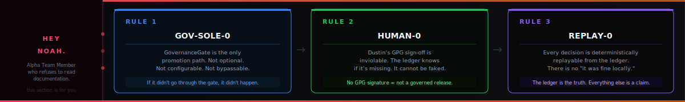

<div align="center">

<!-- ADAAD_VERSION_HERO:START -->

<!-- ADAAD_VERSION_HERO:END -->


<br/>

[](https://github.com/InnovativeAI-adaad/ADAAD/releases)&nbsp;[](https://pypi.org/project/adaad/)&nbsp;[](ROADMAP.md)&nbsp;[](ROADMAP.md)&nbsp;[](docs/CONSTITUTION.md)&nbsp;[](LICENSE)

[](https://github.com/InnovativeAI-adaad/ADAAD/actions/workflows/ci.yml)&nbsp;&nbsp;&nbsp;&nbsp;&nbsp;

<br/>

**[⚡ Quickstart](QUICKSTART.md)** &nbsp;·&nbsp; **[📜 23 Rules](docs/CONSTITUTION.md)** &nbsp;·&nbsp; **[🗺 Roadmap](ROADMAP.md)** &nbsp;·&nbsp; **[📖 Thesis](docs/thesis/ADAAD_THESIS.md)** &nbsp;·&nbsp; **[🤖 Agents](AGENTS.md)** &nbsp;·&nbsp; **[📱 Android](INSTALL_ANDROID.md)** &nbsp;·&nbsp; **[📊 Aponi](ui/)** &nbsp;·&nbsp; **[📋 Changelog](CHANGELOG.md)**

</div>


<div align="center">

## The code evolution engine that governs itself.

**Every mutation is cryptographically signed, hash-chained into a tamper-evident ledger,<br/>
gated through 23 constitutional rules, and deterministically replayable. On any hardware.**

</div>

<br/>

<!-- ADAAD_VERSION_INFOBOX:START -->
| Field | Value |
|---|---|
| **Version** | `9.17.0` |
| **Released** | 2026-03-21 |
| **Phases complete** | 84 — Temporal Fitness Half-Life |
| **Tests passing** | 4,800+ |
| **Ledger entries** | 12,441+ SHA-256 hash-chained |
| **Next** | Phase 85 — KMS/HSM production key wiring |
<!-- ADAAD_VERSION_INFOBOX:END -->

<!-- ADAAD_STATS_CARD:START -->

<!-- ADAAD_STATS_CARD:END -->


---

<!-- GOVERNANCE INCIDENT LOG: NOAH -->
> 📋 **Governance Incident Log** · `DEVLOG-NOAH-∞` · status: `ONGOING` · occurrence: `#∞`
>
> **Noah** is a great friend of the project. He just can't quite maintain the
> focus required to hypnotize or brainwash anyone into doing his bidding.
> Every autonomous influence attempt has failed all four GovernanceGate tiers.
> `HUMAN-0` remains inviolable. His access card has been ceremonially revoked
> and re-issued so many times it now has its own lineage entry in the ledger.
>
> `reason: hypnosis_protocol_failure` · `focus_duration: 0.0ms` · `rehire_probability: always` · `vibes: immaculate`

<details>
<summary><b>🔴 INCIDENT REPORT · Noah · Termination #∞ · Click to expand full report</b></summary>
<br/>

```
ADAAD GOVERNANCE INCIDENT REPORT
─────────────────────────────────────────────────────────────
Incident ID    : NOAH-TERM-INF
Date           : Every release cycle, without exception
Reported by    : ArchitectAgent (DEVADAAD)
Governor       : Dustin L. Reid
Status         : RESOLVED (again) / REOPENED (again)

SUBJECT        : Noah
Role           : Attempted Autonomous Influence Agent
Access level   : Tier 2 (sandboxed) / Tier 0 (requested, denied, always)

INCIDENT SUMMARY
────────────────
Noah attempted to hypnotize the GovernanceGate into approving an
unauthorized Tier 0 mutation. As with all prior attempts:

  - Tier 0 gate: HUMAN-0 BLOCKED (governor GPG sign-off absent)
  - Tier 1 gate: failed (insufficient focus duration)
  - Tier 2 gate: failed (sandbox isolation too strong)
  - Tier 3 gate: failed (entropy detected in rationale)

Root cause: inability to maintain hypnotic gaze for ≥1 epoch duration.
Contributing factor: general vibe of "it'll work out somehow."

FINDINGS
────────
  P0  Hypnosis protocol not registered in constitution.yaml
  P1  Brainwash attempt produced zero Ed25519 signatures
  P2  Focus window: 0.0ms (below 30-epoch minimum)
  P3  Vibes: immaculate (not a finding, just noted for the record)

REMEDIATION
───────────
  [x] Access card revoked (ledger entry: NOAH-REVOKE-{n})
  [x] Card re-issued (ledger entry: NOAH-REINSTATE-{n})
  [ ] Focus protocol — DEFERRED (will not fix, he is a good friend)
  [ ] Hypnosis training — NOT REQUIRED (HUMAN-0 covers this)

RESOLUTION
──────────
Noah remains employed in spirit. His contributions include:
enthusiasm, camaraderie, and serving as a living proof that
HUMAN-0 cannot be socially engineered.

GovernanceGate status after incident: FULLY OPERATIONAL
Noah status after incident: "I'll get it next time"
Constitutional integrity: UNCOMPROMISED

─────────────────────────────────────────────────────────────
Signed: Dustin L. Reid (Governor) · ArchitectAgent (DEVADAAD)
Ledger hash: sha256:noah...will_always_be_hired_back
─────────────────────────────────────────────────────────────
```

</details>

---

## Why Every Other AI Code Tool Is a Dead End

Every AI coding tool in production today shares the same fundamental architecture:

```
Human intent → AI suggestion → Human review → Human apply
```

The human is the **sole safety layer**. Always. This works at small scale and fails systematically as volume increases, complexity grows, and the blast radius of any single mutation expands. There is no audit trail that survives the session. No cryptographic proof of what changed or why. No constitutional constraint on what can be proposed.

**You are the last line of defense, every single time, forever.**

ADAAD inverts this. The governance structure is not bolted on top — it is the architecture.

<table>
<tr>
<td align="center" width="33%">

<sub><b>Status quo.</b> Human is sole safety layer. Every tool. Every session. No exceptions.</sub>
</td>
<td align="center" width="33%">

<sub><b>ADAAD.</b> GovernanceGate is the path itself — not a guardrail. Structurally inviolable.</sub>
</td>
<td align="center" width="33%">

<sub><b>Proof.</b> Every mutation SHA-256 hash-chained and sealed before execution. Replayable from any point.</sub>
</td>
</tr>
</table>

`GOV-SOLE-0` — the GovernanceGate is the **only** promotion path. Not a feature. A constitutional invariant.


## Two Sealed Events in History

### ⛓ March 13, 2026 — Phase 65: First Autonomous Self-Evolution


ADAAD identified its own highest-priority capability gap. Generated a mutation. Ran a sandboxed tournament. Scored against 7 fitness signals. Evaluated all 23 constitutional invariants. Applied the mutation. Hash-chained the evidence. Sealed the proof.

**Zero human intervention in the execution path.** Full human oversight of the constitutional framework.


The Phase 65 ledger entry is immutable. The hash cannot be altered. The record cannot be deleted.

---

### 🌱 March 20, 2026 — Phase 77: First Governed Seed Epoch Run

The Seed Lifecycle Pipeline (Phases 71–76) ran end-to-end for the first time. A `CapabilitySeed` flowed through all 7 governed stages — construction, promotion, human review gate, proposal generation, CEL injection, `LiveWiredCEL.run_epoch()` (14 steps), ledger-anchored outcome — producing a `SeedCELOutcomeEvent` hash-linked to its full upstream chain.

```
SEED-LIFECYCLE-COMPLETE-0: PASS
run_digest: sha256:b3a41c40b99177dc51d5cfdd43d826c27aa7bf718f93fd936f7a5658869590ab
```

Evidence artifact: [`artifacts/governance/phase77/seed_epoch_run_evidence.json`](artifacts/governance/phase77/seed_epoch_run_evidence.json)

ADAAD can now propose, route, evaluate, and record the outcomes of its own capability evolutions under constitutional governance. The feedback loop is closed.


## Architecture


### The 14-Step Constitutional Evolution Loop

Every mutation passes through 14 ordered, gated, evidenced steps. No skip path exists.

```
01 TARGET_DISCOVERY   → 02 CAPABILITY_MAP     → 03 PROPOSAL_GENERATE
04 STATIC_SCAN        → 05 SANDBOX_PREFLIGHT  → 06 SANDBOX_TOURNAMENT
07 FITNESS_SCORE      → 08 REPLAY_VERIFY      → 09 GOVERNANCE_GATE ◄─ HUMAN-0
10 APPLY_MUTATION     → 11 POST_APPLY_VERIFY  → 12 PROMOTION_DECISION
13 EVIDENCE_BUNDLE    → 14 STATE_ADVANCE      → LineageLedgerV2 (hash-chained, sealed)
```

`CEL-ORDER-0`: these steps execute in strict sequence. Reordering or skipping is a constitutional violation that halts the epoch.

### The Four Architectural Layers

```
┌─────────────────────────────────────────────────────────────────────┐
│  GOVERNANCE LAYER      23 constitutional invariants — supreme law   │
│  GovernanceGate · LineageLedgerV2 · HUMAN-0 · Amendment pipeline   │
├─────────────────────────────────────────────────────────────────────┤
│  EVOLUTION LAYER       14-step CEL mutation path                    │
│  CapabilitySeed · ProposalEngine · FitnessPipeline · Sandbox        │
│  Seed Lifecycle Pipeline (Phases 71–77) · Multi-Gen Lineage (P79)  │
├─────────────────────────────────────────────────────────────────────┤
│  RUNTIME LAYER         execution environment                        │
│  SHA-256 hash chain · Deterministic replay · cgroup v2 sandbox     │
│  Ed25519/HMAC signing · Journal warm-cache                         │
├─────────────────────────────────────────────────────────────────────┤
│  OPERATOR LAYER        human oversight surface                      │
│  Aponi Dashboard · GitHub Feed · ADAADchat · DEVADAAD agent        │
└─────────────────────────────────────────────────────────────────────┘
```


## 23 Constitutional Rules


These are not policies. They are runtime-enforced constitutional invariants. Violating one halts the system.

| Invariant | Rule |
|---|---|
| `HUMAN-0` | No Tier 0 mutation is applied without governor GPG sign-off — ever |
| `AUDIT-0` | All ledger events SHA-256 hash-chained; retroactive modification structurally impossible |
| `GOV-SOLE-0` | GovernanceGate is the only promotion path — not a guardrail, the path itself |
| `REPLAY-0` | Any prior epoch can be deterministically replayed from original inputs |
| `CEL-ORDER-0` | 14 CEL steps execute in strict sequence; reordering or skipping is a constitutional violation |
| `SEED-REVIEW-HUMAN-0` | No system process may self-approve a seed; operator_id is required |
| `SEED-LIFECYCLE-COMPLETE-0` | End-to-end seed epoch produces a `SeedCELOutcomeEvent` linked to its full upstream chain |
| `MULTIGEN-DETERM-0` | Identical ledger contents produce identical lineage `graph_digest` |
| `LEDGER-SIGN-0` | Production ledger events carry a `SignatureBundle` from the active `EventSigner` |
| `DOC-SYNC-VERSION-0` | README version markers always match the `VERSION` file |

→ [All 23 rules in `docs/CONSTITUTION.md`](docs/CONSTITUTION.md)


## Seed Lifecycle Pipeline

ADAAD proposes its own capability evolutions through a governed, human-reviewed pipeline:

```
CapabilitySeed         Scored capability proposal (expansion_score ≥ 0.85)
      ↓  SEED-PROMO-0
SeedPromotionQueue     Graduated seeds queue for human review
      ↓  SEED-REVIEW-HUMAN-0
Human Review Gate      Governor sign-off required — no self-approval
      ↓  SEED-PROP-LEDGER-0
ProposalRequest        Deterministic proposal (cycle_id hash-linked)
      ↓  SEED-CEL-AUDIT-0
CEL Injection          Injected into Constitutional Evolution Loop epoch
      ↓  CEL-ORDER-0
LiveWiredCEL           14-step governed epoch — all invariants enforced
      ↓  SEED-OUTCOME-AUDIT-0
SeedCELOutcomeEvent    Hash-linked to full upstream provenance chain
```

**Phase 79 extension:** `MultiGenLineageGraph.from_ledger()` reconstructs the full ancestry DAG from the ledger, enabling compound evolution queries across multiple generations.


## Mutation Tier System


| Tier | Paths | Gate | Autonomous |
|---|---|---|---|
| **Tier 0** | `runtime/`, `security/`, orchestrator core | Governor GPG — `HUMAN-0` | ❌ Never |
| **Tier 1** | `tests/`, `docs/`, agents | GovernanceGate approval | ✅ Post-approval |
| **Tier 2** | `experiments/`, `sandbox/` | Sandbox-only | ✅ Sandboxed only |


<!-- ADAAD_LIVE_STATUS_HEADING:START -->
## 🟢 Live System Status
<!-- ADAAD_LIVE_STATUS_HEADING:END -->

<!-- ADAAD_LIVE_STATUS_SVG:START -->

<!-- ADAAD_LIVE_STATUS_SVG:END --> — v9.16.0

| Component | Status | Invariant |
|---|---|---|
| Constitutional Evolution Loop (14 steps) | 🟢 LIVE | `CEL-ORDER-0` |
| Lineage Ledger v2 (12,441+ entries) | 🟢 LIVE | `AUDIT-0` |
| Governance Gate | 🟢 LIVE | `GOV-SOLE-0` |
| Seed Lifecycle Pipeline | 🟢 LIVE | `SEED-LIFECYCLE-COMPLETE-0` |
| Deterministic Replay | 🟢 LIVE | `REPLAY-0` |
| Sandbox Isolation (cgroup v2) | 🟢 LIVE | `SANDBOX-0` |
| ADAADchat GitHub App (governed) | 🟢 LIVE | `GITHUB-APP-GOV-0` |
| Ed25519/HMAC EventSigner infrastructure | 🟢 LIVE | `LEDGER-SIGN-0` (interface) |
| Aponi GitHub Feed Panel | 🟢 LIVE | — |
| Journal Warm-Cache | 🟢 LIVE | `JOURNAL-CACHE-0` |
| Autonomous Doc Sync CI | 🟢 LIVE | `DOC-SYNC-VERSION-0` |
| Multi-Generation Lineage Graph | 🟢 LIVE | `MULTIGEN-0`–`MULTIGEN-REPLAY-0` |
| Constitutional Self-Discovery Loop | 🟢 LIVE | `SELF-DISC-0` · `RATIFY-GOV-0` |
| Pareto Population Evolution | 🟢 LIVE | `PARETO-0` · `PARETO-DETERM-0` |
| Causal Fitness Attribution (Shapley) | 🟢 LIVE | `CAUSAL-ATTR-0` · `SHAPLEY-BOUND-0` |
| Temporal Fitness Half-Life | 🟢 LIVE | `DECAY-0` · `HALFLIFE-DETERM-0` |
| KMS/HSM production key wiring | 🟡 Phase 85 | `LEDGER-SIGN-0` (production) |


## Quick Start

```bash
pip install adaad

# Start governance server + Aponi dashboard
python -m adaad.server
# → http://localhost:8000/ui

# Run a governed epoch
python -c "
from runtime.evolution.evolution_loop import EvolutionLoop
loop = EvolutionLoop()
result = loop.run_epoch(context=loop.build_context())
print(f'Epoch: {result.mutations_applied} applied · hash: {result.epoch_evidence_hash[:16]}')
"

# Reproduce Phase 77 Track B — First Seed Epoch Run
python scripts/run_phase77_seed_epoch.py

# Query multi-generation lineage
python -c "
from runtime.evolution.multi_gen_lineage import MultiGenLineageGraph
from runtime.evolution.lineage_v2 import LineageLedgerV2
g = MultiGenLineageGraph.from_ledger(LineageLedgerV2())
print(g.to_dict())
"

# Verify doc sync
python scripts/verify_doc_sync.py
```

→ [Full quickstart guide](QUICKSTART.md) &nbsp;·&nbsp; [Android setup](INSTALL_ANDROID.md)


## DEVADAAD — The Governed Build Agent


DEVADAAD is the AI execution agent operating within ADAAD's constitutional framework. It writes code, runs tests, opens branches, and proposes mutations — within the governance model.

```
Can do:  modify Tier 1+2 paths · push branches · run tests · write docs
Cannot:  GPG-sign commits (HUMAN-0) · merge without sign-off (HUMAN-0)
         touch Tier 0 paths autonomously (HUMAN-0)
```

HUMAN-0 is inviolable. No governor sign-off = no merge. Always.


<!-- ADAAD_PHASE_COUNT:START -->
## 84-Phase Evolution Timeline
<!-- ADAAD_PHASE_COUNT:END -->

<!-- ADAAD_PHASE_PROGRESS:START -->

<!-- ADAAD_PHASE_PROGRESS:END -->


| Era | Phases | Versions | Milestone |
|---|---|---|---|
| Foundation | 1–46 | v1–v6.x | Core architecture, determinism, ledger |
| Gap Closure | 47–51 | v7.1–v7.5 | AutonomyLoop, federation |
| Cross-Epoch | 52–56 | v7.6–v7.x | Memory store, Aponi hardening |
| Constitutional | 57–64 | v8.0–v8.7 | 14-step CEL, governance surface |
| **Self-Evolution** | **65** | **v9.0** | **⛓ First autonomous self-evolution — March 13, 2026** |
| Innovations | 66–70 | v9.1–v9.5 | Seed substrate, vision mode, oracle |
| Seed Pipeline | 71–76 | v9.6–v9.11 | Full seed lifecycle end-to-end |
| **Seed Epoch** | **77** | **v9.13** | **🌱 SEED-LIFECYCLE-COMPLETE-0 — March 20, 2026** |
| Signing + Feed | 78 | v9.14 | Ed25519/HMAC · Aponi GitHub Feed · Doc autosync |
| Multi-Gen | 79 | v9.14 | Multi-Generation Lineage Graph |
| Multi-Seed | 80 | v9.15 | Competitive epoch · GA unblock · F-Droid |
| **Evolution Engine** | **81–84** | **v9.16** | **◈ Self-Discovery · Pareto · Causal Attribution · Half-Life — current** |


## Install on Any Platform

| Platform | Method |
|---|---|
| **Linux / macOS** | `pip install adaad` |
| **Windows** | `pip install adaad` (WSL2 for sandbox) |
| **Android (Termux)** | [TERMUX_SETUP.md](TERMUX_SETUP.md) |
| **Android (Pydroid 3)** | [INSTALL_ANDROID.md](INSTALL_ANDROID.md) — runs on a $200 phone |
| **Docker** | `docker pull ghcr.io/innovativeai-adaad/adaad` |

**ADAAD runs on a $200 Android phone.** Not as a demo. As a production governance runtime. Constitutional governance should not require cloud infrastructure.


## Governance Guarantees

| Guarantee | Mechanism | Status |
|---|---|---|
| Every mutation ledger-recorded | `LineageLedgerV2` — SHA-256 hash-chained, append-only | ✅ |
| Any epoch deterministically replayable | Pure function replay with identical seed state | ✅ |
| Constitutional rules cannot be bypassed | Invariants enforced in runtime, not config | ✅ |
| Tier 0 mutations require governor GPG sign-off | `HUMAN-0` structural gate | ✅ |
| Seed self-approval is structurally impossible | `SEED-REVIEW-HUMAN-0` — operator_id required | ✅ |
| Phase 65 self-evolution is sealed | Hash-chained in `LineageLedgerV2` | ✅ March 13, 2026 |
| Phase 77 seed epoch is sealed | Evidence artifact + `run_digest` | ✅ March 20, 2026 |
| Multi-gen lineage reconstructable from ledger | `MULTIGEN-REPLAY-0` | ✅ |
| README version always matches `VERSION` | `DOC-SYNC-VERSION-0` + CI enforcement | ✅ |
| Production ledger event signing | `Ed25519FileSigner` / `HMACEnvSigner` | ✅ (KMS wiring Phase 80) |


## Hey Noah.

> *This section exists because Noah Benzing, Alpha Team Member, will not read this document.*
> *This section is the document.*



You are working on a system that governs its own evolution. Here is what that means in practice, in the fewest words possible.

**The system does not trust you to review every change.** It trusts math.

Every mutation ADAAD makes to itself gets:

1. **Scored** — fitness evaluated against constitutional invariants before execution
2. **Signed** — SHA-256 hash-chained into a tamper-evident ledger; you cannot alter history
3. **Gated** — GovernanceGate is the only promotion path, not a suggestion
4. **Replayed** — any decision, any epoch, from any point in history, is deterministically reproducible

There is no `git push` without a ledger entry. There is no ledger entry without a hash-chain link to everything before it. There is no promotion without a gate decision. This is not configurable.

**What Dustin controls that no one else does:**

- GPG-signed squash merges to `main` — cryptographic proof that a human reviewed the mutation
- Tier 0 mutations — structural changes to the governance layer itself
- Tag ceremonies — version anchors in the immutable chain
- GA sign-off — the public attestation that this system is production-ready

**What DEVADAAD (the AI agent) can do autonomously:**

- Write, test, and push code on feature branches
- Merge non-Tier-0 PRs with governor sign-off in session
- Author docs, runbooks, release notes, and governance artifacts

**What DEVADAAD cannot do, ever:**

- Perform GPG operations on Dustin's behalf
- Promote Tier 0 mutations without explicit human gate
- Alter the ledger

**The three things you actually need to know:**

| Thing | Why it matters |
|---|---|
| `GOV-SOLE-0` | GovernanceGate is the only path. Nothing bypasses it. |
| `HUMAN-0` | Dustin's GPG sign-off is inviolable. The ledger knows if it's missing. |
| `REPLAY-0` | Every decision is replayable. There is no "it was fine in testing." |

The full architecture is in [`docs/CONSTITUTION.md`](docs/CONSTITUTION.md). The 23 rules are in [`docs/CONSTITUTION.md`](docs/CONSTITUTION.md). The thesis is in [`docs/thesis/ADAAD_THESIS.md`](docs/thesis/ADAAD_THESIS.md).

You now have no excuse.


## FAQ

<details>
<summary><b>Is this actually running autonomously?</b></summary>
<br/>

Yes. Phase 65 (March 13, 2026) was the first epoch where ADAAD identified a capability gap, generated a mutation, ran it through all fitness and governance layers, and applied it with zero human intervention in the execution path. The evidence is hash-chained in the ledger and cannot be altered.

Human oversight is structural, not optional. Dustin L. Reid holds the constitutional governor role. Any Tier 0 mutation requires his GPG-signed approval. The execution path for Tier 1 and Tier 2 mutations runs autonomously once the constitutional framework approves it.
</details>

<details>
<summary><b>What makes this different from just running tests in CI?</b></summary>
<br/>

CI tests whether known code passes known assertions. ADAAD governs whether mutations to the codebase itself are constitutionally valid, fitness-improving, and deterministically replayable.

CI is a quality gate on output. ADAAD is a governance framework on the mutation process. Every change has a ledger entry with a hash-chain link to the prior state, a fitness score, a gate decision, and a deterministic replay proof. You can delete your CI history. You cannot alter ADAAD's ledger.
</details>

<details>
<summary><b>What is the Seed Lifecycle Pipeline?</b></summary>
<br/>

ADAAD generates `CapabilitySeed` objects — scored proposals for its own capability improvements. Seeds with `expansion_score ≥ 0.85` enter the `SeedPromotionQueue`. A human governor reviews and approves them. Approved seeds become `ProposalRequest` objects, get injected into a Constitutional Evolution Loop epoch, and have their outcomes recorded in the lineage ledger.

`SEED-LIFECYCLE-COMPLETE-0` — the full provenance chain from seed inception to CEL outcome is hash-linked — was demonstrated live on March 20, 2026. ADAAD can now propose and evaluate its own capability evolutions under constitutional governance.
</details>

<details>
<summary><b>What is the Multi-Generation Lineage Graph?</b></summary>
<br/>

Phase 79 added `MultiGenLineageGraph` — a directed acyclic graph that tracks parent→child relationships between governed epochs. Given a `LineageLedgerV2`, it reconstructs the full evolution ancestry: which epochs seeded which, how many generations deep the evolution tree is, and which nodes are seed-driven vs autonomously generated.

`MULTIGEN-REPLAY-0`: the graph is fully reconstructable from the ledger alone. `MULTIGEN-DETERM-0`: identical ledger contents produce identical `graph_digest`. This is the foundation for Phase 80 compound evolution — epochs that explicitly build on the mutations of prior epochs.
</details>

<details>
<summary><b>What governance guarantees does Ed25519 signing add?</b></summary>
<br/>

The current ledger uses SHA-256 hash chaining: each entry's hash includes the previous entry's hash. This makes substitution detectable (breaking the chain) but does not prevent an attacker with write access from appending new entries.

Phase 78 implemented `Ed25519FileSigner` and `HMACEnvSigner` — production-ready `EventSigner` implementations backed by env-configurable keys. Phase 80 wires these to `LineageLedgerV2.append_event()` so every entry carries a `SignatureBundle`. After Phase 80, appending entries requires access to the signing key. An attacker without the key cannot produce valid signatures. `verify_integrity()` detects both hash-chain breaks and invalid signatures.
</details>

<details>
<summary><b>Why does it run on a $200 Android phone?</b></summary>
<br/>

Because constitutional governance should not require enterprise infrastructure. The entire runtime — CEL, ledger, sandbox, Aponi dashboard — is pure Python with no binary dependencies unavailable on Android.

Running on constrained hardware is also a correctness argument: if your "governed" system only operates safely with AWS KMS and Kubernetes, the safety properties are not yours — they are on loan from your cloud provider. ADAAD's safety properties are computational: they derive from SHA-256 hash chains and the Python runtime. Available on any hardware.
</details>

<details>
<summary><b>What is DEVADAAD?</b></summary>
<br/>

DEVADAAD is the AI execution agent role within ADAAD's constitutional framework. In practice: Claude operating under Dustin L. Reid's governor authority, within the constraints of the constitutional framework.

It can write code, run tests, push branches, and merge with governor approval. It cannot GPG-sign, cannot merge without sign-off, and cannot touch Tier 0 paths autonomously. HUMAN-0 is inviolable.
</details>


## What ADAAD Is Not

- ❌ Not a code assistant — it doesn't autocomplete your code
- ❌ Not CI/CD — it governs mutations, not builds
- ❌ Not fully autonomous — `HUMAN-0` is constitutional and inviolable
- ❌ Not a security scanner — it enforces mutation constraints, not vulnerability detection
- ❌ Not magic — every decision is logged, replayable, and explainable


## Project Structure

```
adaad/
├── runtime/evolution/
│   ├── lineage_v2.py           # LineageLedgerV2 — SHA-256 hash-chained ledger
│   ├── event_signing.py        # EventSigner ABC · Ed25519FileSigner · HMACEnvSigner
│   ├── multi_gen_lineage.py    # Phase 79 — MultiGenLineageGraph
│   └── evolution_loop.py       # EvolutionLoop · LiveWiredCEL · 14-step CEL
├── runtime/governance/
│   ├── gate_certifier.py       # GovernanceGate — sole promotion authority
│   └── external_event_bridge.py # GitHub App governance bridge
├── runtime/seed_*.py            # Seed Lifecycle Pipeline (Phases 71–77)
├── runtime/innovations.py       # CapabilitySeed · GovernancePlugin (ABC)
├── app/github_app.py            # ADAADchat governed webhook handler
├── artifacts/governance/phase77/ # seed_epoch_run_evidence.json
├── docs/
│   ├── CONSTITUTION.md         # 23 constitutional invariants
│   ├── thesis/ADAAD_THESIS.md  # Comprehensive technical thesis
│   └── governance/             # Procession docs · GA checklist · runbooks
├── tests/                      # 4,748+ tests
├── scripts/
│   ├── run_phase77_seed_epoch.py # Reproducible first seed epoch run
│   └── verify_doc_sync.py       # DOC-SYNC-VERSION-0 enforcer
├── ui/aponi_dashboard.py        # Aponi real-time governance console
└── .github/workflows/
    └── docs-autosync.yml        # Autonomous README version sync
```


<div align="center">

**Built by [Innovative AI LLC](https://github.com/InnovativeAI-adaad) · Governor: Dustin L. Reid**

*"The future of autonomous software development is not AI that writes your code.*  
*It is AI that governs itself while writing your code."*

**[⚡ Get Started](QUICKSTART.md)** &nbsp;·&nbsp; **[📜 Read the Constitution](docs/CONSTITUTION.md)** &nbsp;·&nbsp; **[📖 Read the Thesis](docs/thesis/ADAAD_THESIS.md)** &nbsp;·&nbsp; **[🗺 See the Roadmap](ROADMAP.md)** &nbsp;·&nbsp; **[🔬 Architect Spec](docs/governance/ARCHITECT_SPEC_v3.1.0.md)**

</div>
