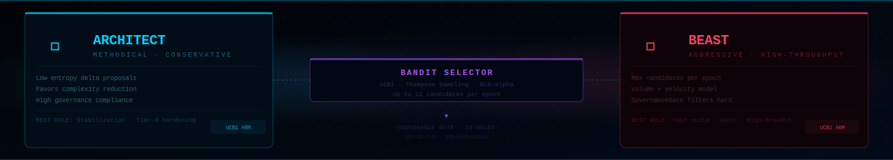
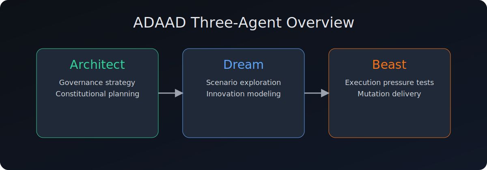
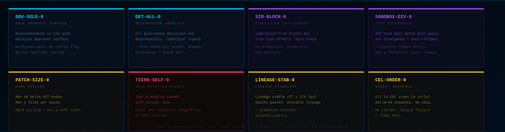
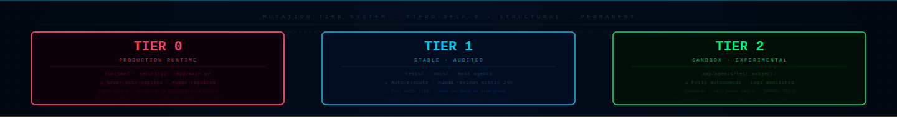
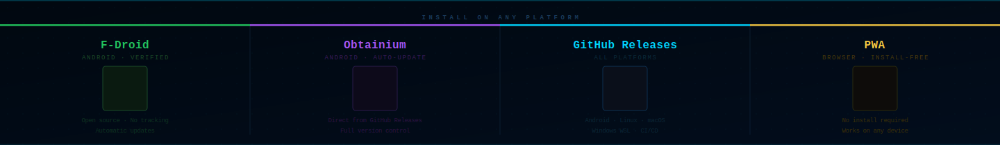
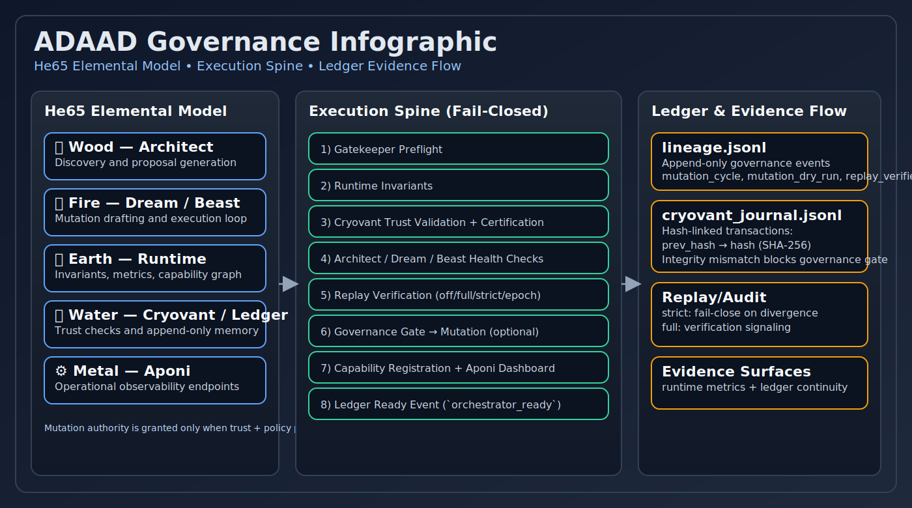
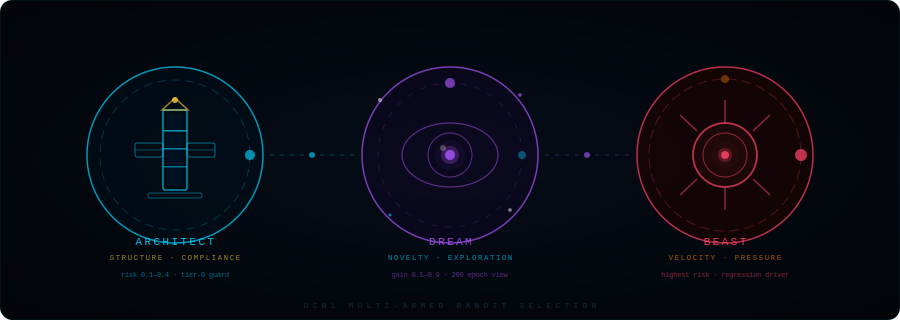

<div align="center">


<br/>

[](https://github.com/InnovativeAI-adaad/ADAAD/releases)&nbsp;[](https://pypi.org/project/adaad/9.12.0/)&nbsp;[](ROADMAP.md)&nbsp;[](ROADMAP.md)&nbsp;[](docs/CONSTITUTION.md)&nbsp;[](LICENSE)

[](https://github.com/InnovativeAI-adaad/ADAAD/actions/workflows/ci.yml)&nbsp;&nbsp;&nbsp;&nbsp;&nbsp;

<br/>

**[⚡ Quickstart](QUICKSTART.md)** &nbsp;·&nbsp; **[📜 The 23 Rules](docs/CONSTITUTION.md)** &nbsp;·&nbsp; **[🗺 Roadmap](ROADMAP.md)** &nbsp;·&nbsp; **[🤖 Agents](AGENTS.md)** &nbsp;·&nbsp; **[📱 Android](INSTALL_ANDROID.md)** &nbsp;·&nbsp; **[🔬 Examples](examples/)** &nbsp;·&nbsp; **[📊 Aponi](ui/)** &nbsp;·&nbsp; **[📋 Changelog](CHANGELOG.md)**

</div>


> **ADAAD is a constitutionally governed code evolution engine** — every mutation cryptographically signed, hash-chained into a tamper-evident ledger, deterministically replayable, and gated through 23 constitutional rules before a single byte changes.
>
> *It has already evolved itself. March 13, 2026. The hash is in the ledger.*

<br/>

<!-- ADAAD_VERSION_INFOBOX:START -->
> Version infobox placeholder (governed sync source).
<!-- ADAAD_VERSION_INFOBOX:END -->

## Governance & Determinism Guarantees (Current State)

Key safety controls remain fail-closed and deterministic by default:

- `ADAAD_DETERMINISTIC_LOCK` — enforces deterministic-only execution paths.
- `ADAAD_DISPATCH_LATENCY_BUDGET_MS` — bounded dispatch latency budget for governance-sensitive dispatch paths.

See `docs/ENVIRONMENT_VARIABLES.md` for full definitions and defaults.

## Why ADAAD Is Different

Every AI code tool works the same way: **suggest → you apply.** No audit trail. No fitness score. No rollback. You are the last line of defense. ADAAD inverts this — the `GovernanceGate` is the last line of defense, not you.

<table>
<tr>
<td align="center" width="33%">

<sub><strong>Status quo:</strong> Every tool puts the human in the critical path as the only safety layer.</sub>
</td>
<td align="center" width="33%">

<sub><strong>ADAAD:</strong> GovernanceGate is the sole approval surface. Constitutional. Non-bypassable.</sub>
</td>
<td align="center" width="33%">

<sub><strong>Proof:</strong> Every approved mutation is hash-chained, replay-verified, and evidenced.</sub>
</td>
</tr>
</table>




## ADAAD vs. Everything Else




## ⛓ Phase 65 — First Autonomous Self-Evolution


> **March 13, 2026.** Zero human intervention in the execution path. Full human oversight of the constitutional framework. The hash is in the ledger.


<details>
<summary><strong>View full evidence ledger entry (JSON)</strong></summary>
<br/>

```json
{
  "event":   "EPOCH_COMPLETE",
  "phase":   65,
  "version": "9.0.0",
  "date":    "2026-03-13",

  "constitutional_invariants_enforced": [
    "MUTATION-TARGET", "AUDIT-0", "REPLAY-0", "CEL-ORDER-0",
    "CEL-EVIDENCE-0", "SANDBOX-DIV-0", "GATE-V2-EXISTING-0"
  ],

  "execution_trace": {
    "01_TARGET_DISCOVERY":   "✓ CodeIntelModel → highest-priority Tier-1 capability",
    "02_CAPABILITY_MAP":     "✓ CapabilityDiscovery → cap:runtime.evolution.cel_wiring.live_mode",
    "03_PROPOSAL_GENERATE":  "✓ ProposalEngine → AST mutation — proposal_hash recorded",
    "04_STATIC_SCAN":        "✓ StaticSafetyScanner → all 4 AST rules PASS",
    "05_SANDBOX_TOURNAMENT": "✓ SandboxTournament → top candidate in ephemeral container",
    "06_FITNESS_SCORE":      "✓ FitnessEngineV2 → 7/7 signals above baseline",
    "07_GOVERNANCE_GATE_V2": "✓ GovernanceGateV2 → APPROVED (Class A)",
    "08_GOVERNANCE_GATE":    "✓ GovernanceGate → CONFIRMED — all 23 rules pass",
    "09_PATCH_APPLY":        "✓ ASTDiffPatch → atomic apply — replay_verifier: 0 divergences",
    "10_CAPABILITY_UPDATE":  "✓ CapabilityGraph → target bumped, CapabilityChange to ledger",
    "11_EPOCH_EVIDENCE":     "✓ EpochEvidence → SHA-256 hash-chained into evolution ledger",
    "12_HUMAN_OVERSIGHT":    "✓ Full trail reviewed in Aponi — acknowledgement hash committed"
  },

  "proof": {
    "replay_divergences": 0,
    "governance_bypasses": 0,
    "retroactive_evidence": false,
    "silent_failures": 0
  }
}
```

</details>


## 📅 77-Phase Evolution Timeline


| Phase | Era | Milestone | Version |
|:---:|:---|:---|:---:|
| 1–2 | Foundation | `GovernanceGate` · Evidence Ledger · SHA-256 hash-chaining | v1.0 |
| 3–4 | Adaptive Intelligence | `AdaptiveWeights` EMA · `SemanticDiffEngine` AST analysis | v2.x |
| 5–6 | Federation & Autonomy | Multi-repo federation · HMAC gating · roadmap self-amendment | v3.x |
| 7–8 | Governance Calibration | Reviewer reputation · governance health dashboard | v3.2–3.3 |
| 9–56 | Core Build-Out | 48 phases · Hardening · Evidence · Scale · Intelligence | v4.x–8.x |
| 57 | Keystone | ProposalEngine auto-provisioning | v8.0 |
| 58 | Perception | CodeIntelModel — code intelligence layer | v8.1 |
| 59 | Identity | CapabilityGraph v2 + CapabilityTargetDiscovery | v8.2 |
| 60 | Motor | AST Mutation Substrate + SandboxTournament | v8.3 |
| 61 | Evolution | Lineage Engine + CompatibilityGraph | v8.4 |
| 62 | Intelligence | MultiHorizon FitnessEngine v2 | v8.5 |
| 63 | Judgment | GovernanceGate v2 + Exception Tokens | v8.6 |
| 64 | Selfhood | Constitutional Evolution Loop (CEL) + EpochEvidence | v8.7 |
| **65** | **Emergence ⛓** | **First Autonomous Self-Evolution — March 13, 2026** | **v9.0** |
| 66 | Hardening Tier Alpha | Telemetry completeness · lineage invariants · governance contracts | v9.1 |
| 67–68 | Operator Control | Operator-gated deployment · LLM failover governance | v9.2–9.3 |
| 69–70 | Innovations Router | Seed ingestion pipeline · innovation scoring | v9.4–9.5 |
| 71–72 | Seed Lifecycle | Seed promotion queue · graduated seed tracking | v9.6–9.7 |
| 73 | Seed Governance | Human-governed seed review · `audit:write` scope · Aponi review panel | v9.8 |
| 74 | Seed → Proposal | Seed-to-Proposal Bridge · deterministic `cycle_id` routing | v9.9 |
| **75** | **Seed CEL Injection** | **Approved seeds wired into CEL Step 4 as advisory signal** | **v9.10.0** |
| **76** | **Seed CEL Outcome Recorder** | **CEL epoch outcome recorded back to lineage ledger — full loop closed** | **v9.11.0** |
| **77** | **GitHub App Governance** | **GitHub App governance + Constitution version alignment** | **v9.12.0** |


## Quick Start


**Desktop / Linux / macOS / CI**

**Option A — Install from PyPI (recommended, Python ≥ 3.11)**

```bash
pip install adaad
```

**Option B — Run from source**

```bash
git clone https://github.com/InnovativeAI-adaad/ADAAD.git && cd ADAAD

python -m venv .venv && source .venv/bin/activate
pip install -r requirements.server.txt

PYTHONPATH=. python -m pytest tests/test_boot_preflight.py -q  # always first

ADAAD_CEL_ENABLED=true ADAAD_SANDBOX_ONLY=true ADAAD_ENV=dev python app/main.py
```

**Android — Termux / Pydroid3**

```bash
pip install -r requirements.phone.txt

CRYOVANT_DEV_MODE=1 ADAAD_ENV=dev python app/main.py --host 0.0.0.0 --port 8000
```

**Aponi Governance Console**

```bash
PYTHONPATH=. python -m ui.aponi --port 8080   # → http://localhost:8080
```

> **[⚡ QUICKSTART.md](QUICKSTART.md)** &nbsp;·&nbsp; **[📱 INSTALL_ANDROID.md](INSTALL_ANDROID.md)** &nbsp;·&nbsp; **[📟 TERMUX_SETUP.md](TERMUX_SETUP.md)**


## 🟢 Live System Status

| System | Status |
|:---|:---|
| 🟢 GovernanceGate | **ACTIVE · NON-BYPASSABLE** · `GOV-SOLE-0` |
| 🟢 Constitutional Evolution Loop | **14-STEP · ORDERED** · `CEL-ORDER-0` |
| 🟢 Evidence Ledger | **HASH-CHAINED · APPEND-ONLY** · `CEL-EVIDENCE-0` · 12,441 entries |
| 🟢 FitnessEngine v2 | **7 SIGNALS · ADAPTIVE WEIGHTS** · `FIT-BOUND-0` |
| 🟢 SandboxTournament | **OPERATIONAL · EPHEMERAL** · `SANDBOX-DIV-0` |
| 🟢 Deterministic Replay | **ZERO DIVERGENCE** · `DET-ALL-0` |
| 🟢 WeightAdaptor | **EMA DESCENT · TELEMETRY LIVE** · `FIT-DIV-0` |
| 🟢 Federation | **HMAC-GATED · DUAL-GATE** · `federation_dual_gate` |
| 🟢 CodeIntelModel | **SCANNING · DETERMINISM-VERIFIED** · `INTEL-DET-0` |
| 🟢 Innovations Pipeline | **SEED-CEL-AUDIT-0 · SEED-REVIEW-0 · SEED-PROP-0** |
| 🟢 ADAADchat App | **ONLINE · GOVERNANCE-ALIGNED** · conversational operator surface |
| 🟢 ExternalEventBridge | **ACTIVE · SHA-256 JSONL CHAINED** · `GITHUB-AUDIT-0` |
| 🟢 Autonomous Self-Evolution | **PHASE 65 PROVEN · LEDGER SEALED** · `MUTATION-TARGET` |


## Architecture

<div align="center">

</div>

<br/>

Three LLM-backed agents — **Architect**, **Dream**, **Beast** — compete for epoch selection via UCB1 bandit. Every winning proposal traverses the full **14-step Constitutional Evolution Loop** before a single byte changes. The `GovernanceGate` is the sole approval surface. Invariant `GOV-SOLE-0`: it cannot be bypassed. Ever.

<div align="center">

</div>


## The 14-Step Constitutional Evolution Loop

All 14 steps execute in strict sequence. One failure → clean halt. Zero silent errors. **`CEL-ORDER-0`**: the order is structural, not configurable.

<div align="center">

| Step | Name | Type | On Failure |
|:---:|:---|:---:|:---|
| `01` | `MODEL-DRIFT-CHECK` | Guard | Blocks epoch — determinism state stale |
| `02` | `LINEAGE-SNAPSHOT` | Capture | Records `capability_graph_before` hash |
| `03` | `FITNESS-BASELINE` | Measure | Pre-epoch 7-signal composite recorded |
| `04` | `PROPOSAL-GENERATE` | Generate | Architect · Dream · Beast in parallel · seed advisory if injected |
| `05` | `AST-SCAN` | Preflight | StaticSafetyScanner — 4 hard AST rules |
| `06` | `SANDBOX-EXECUTE` | Test | Ephemeral clone — `SANDBOX_ONLY` respected |
| `07` | `REPLAY-VERIFY` | Verify | Hash mismatch → auto-rollback (`SANDBOX-DIV-0`) |
| `08` | `FITNESS-SCORE` | Score | Determinism divergence → unconditional veto |
| `09` | `GOVERNANCE-GATE-V2` | Gate | 5 diff-aware AST rules — Class A / B split |
| `10` | `GOVERNANCE-GATE` | Gate | **23 constitutional rules — ALL must pass** |
| `11` | `LINEAGE-REGISTER` | Register | Survivors chained into lineage DAG |
| `12` | `PROMOTION-DECISION` | Promote | `CapabilityGraph` + `PromotionEvent` recorded |
| `13` | `EPOCH-EVIDENCE` | Seal | SHA-256 hash-chained ledger entry — immutable |
| `14` | `STATE-ADVANCE` | Advance | Epoch counter + `epoch_complete.v1` emitted |

</div>

```
ADAAD_SANDBOX_ONLY=true  →  all 14 steps run · zero writes · full audit trail
```

<details>
<summary><strong>Step 4 Seed Advisory (Phase 76)</strong></summary>
<br/>

Since Phase 76, an approved seed `ProposalRequest` may be injected into CEL Step 4 via `inject_seed_proposal_into_context()`. The seed is **advisory only** — Step 4 falls back to the default ProposalRequest if the key is absent. `SEED-CEL-HUMAN-0`: injected context cannot trigger mutation without `GovernanceGate` + `HUMAN-0` sign-off.

```python
# CEL Step 4 — Phase 76 seed advisory wire
context = inject_seed_proposal_into_context(context, seed_entry, ledger)
request = resolve_step4_request(context)   # seed if present, default if absent
```

</details>


## Three Competing Mutation Agents




<div align="center">
<table>
<tr>
<td align="center" width="33%">

<br/><strong>Architect</strong><br/>
<sub>Governance-safe structural design. Low risk (0.1–0.4). Owns Tier-0 guard decisions and constitutional compliance.</sub>
</td>
<td align="center" width="33%">

<br/><strong>Dream</strong><br/>
<sub>High-novelty exploration. High expected gain (0.5–0.9). Sees 200 epochs ahead. Experimental and behavioral mutations.</sub>
</td>
<td align="center" width="33%">

<br/><strong>Beast</strong><br/>
<sub>Mutation velocity at the constitutional edge. Highest risk, highest pressure. Drives fitness regression targets hard.</sub>
</td>
</tr>
</table>
</div>

All three compete via **UCB1 multi-armed bandit** — switches to Thompson Sampling after ≥30 non-stationary epochs. Up to **12 candidates per epoch** via BLX-alpha crossover. The GovernanceGate decides. The bandit learns.

```
  UCB1 selection — values adapt each epoch
  ─────────────────────────────────────────────────────────────────
  Architect  ██████████               UCB 0.73  risk 0.2  EXPLOIT
  Dream      ███████████████          UCB 0.81  risk 0.6  EXPLORE  ◄ selected
  Beast      ██████████████           UCB 0.79  risk 0.9  EXPLOIT
  ─────────────────────────────────────────────────────────────────
  Winning proposal  →  14-step CEL  →  GovernanceGate  →  ledger seal
```


## The 23 Constitutional Rules

<div align="center">

| 🔴 9 Blocking | 🟡 5 Warning | 🔵 9 Advisory |
|:---:|:---:|:---:|
| Unconditional halt | Tier-gated escalation | Audit trail only |
| No override. No exceptions. | Blocking in Tier 0 | Recorded every epoch |

</div>

<br/>

<details>
<summary><strong>🔴 9 Blocking Rules — Unconditional halt. No override. No exceptions.</strong></summary>
<br/>

| Rule | Enforcement |
|:---|:---|
| `single_file_scope` | Mutations confined to one target file |
| `ast_validity` | Resulting AST must parse cleanly |
| `no_banned_tokens` | No `exec`, `eval`, `os.system`, shell equivalents |
| `signature_required` | Every mutation must carry a valid cryptographic signature |
| `lineage_continuity` | Must chain to an existing, verified lineage record |
| `resource_bounds` | Memory and compute bounds enforced per tier |
| `federation_dual_gate` | Cross-repo: `GovernanceGate` approval in both repos |
| `federation_hmac_required` | HMAC validation on all federation channel ops |
| `soulbound_privacy_invariant` | No identity-linked data exported outside governed channels |

</details>

<details>
<summary><strong>🟡 5 Warning Rules — Flagged in Tier 1/2. Blocking in Tier 0.</strong></summary>
<br/>

| Rule | Threshold |
|:---|:---|
| `max_complexity_delta` | Cyclomatic complexity delta ≤ +2 |
| `test_coverage_maintained` | Coverage delta ≥ 0 — must never decrease |
| `max_mutation_rate` | Epoch mutation density within anti-flood rate |
| `import_smoke_test` | All new imports resolve at import time |
| `entropy_budget_limit` | Proposal entropy within deterministic bounds |

</details>

<details>
<summary><strong>🔵 9 Advisory Rules — Recorded in every audit trail and evidence bundle.</strong></summary>
<br/>

| Rule | Tracks |
|:---|:---|
| `deployment_authority_tier` | Tier-based deployment authority |
| `revenue_credit_floor` | Credit floor for contributor attribution |
| `reviewer_calibration` | Historical reviewer calibration score |
| `bandit_arm_integrity_invariant` | UCB1 / Thompson Sampling state consistency |
| `market_signal_integrity_invariant` | Market signal provenance and freshness |
| `gate_v2_complexity` | GovernanceGateV2 AST complexity diff |
| `gate_v2_import_surface` | GovernanceGateV2 import surface delta |
| `gate_v2_error_guard` | GovernanceGateV2 error guard preservation |
| `gate_v2_semantic_scope` | GovernanceGateV2 semantic scope adherence |

</details>


## 8 Permanent Architectural Invariants




## Fitness Engine — 7 Signals

Every mutation is scored before `GovernanceGate` sees it. **Determinism divergence is an unconditional veto** — it cannot be overridden by any weight or governance exception.

<div align="center">

| Signal | Weight Range | Veto |
|:---|:---:|:---:|
| 🧪 Test delta — coverage + failure reduction | `[0.05, 0.70]` | |
| 🌀 Complexity delta — cyclomatic change | `[0.05, 0.70]` | |
| ⚡ Performance delta — runtime benchmark | `[0.05, 0.70]` | |
| 📊 Governance compliance — 10-epoch rolling | `[0.05, 0.70]` | |
| 🏗 Architectural fitness — coupling + centrality | `[0.05, 0.70]` | |
| 🔒 **Determinism** — replay divergence | `[0.05, 0.70]` | **ANY divergence = halt** |
| 🧹 Node economy — net AST additions | `[0.05, 0.70]` | |

</div>

```python
score = sum(signal_value[i] * adaptive_weight[i] for i in range(7))

if determinism_divergence > 0:  raise VetoError("FIT-DIV-0")       # unconditional
if score < baseline_composite:  raise RejectError("below baseline")
if not gate_v2.approve(patch):  raise RejectError("GovernanceGateV2")
if not gate.approve(patch):     raise RejectError("GovernanceGate")
# → APPROVED
```


## Mutation Tier System



| Tier | Paths | Mutations | Review |
|:---:|:---|:---:|:---:|
| 🔴 **0** | `runtime/`, `security/`, `app/main.py` | ❌ Never auto-applied | Human required |
| 🟡 **1** | `tests/`, `docs/`, most agents | ✅ Auto-execute | Within 24h |
| 🟢 **2** | `app/agents/test_subject/` | ✅ Fully autonomous | Logs monitored |

`TIER0-SELF-0` is permanent and structural. Tier-0 modules cannot be mutation targets — not via configuration, not via exception token, not via governance override.


## Innovations & Seed Pipeline (Phases 69–75)

The **Innovations Pipeline** is ADAAD's governed pathway for human-sourced ideas to enter the constitutional evolution loop. Seeds are ingested, scored, promoted, reviewed by a human operator, converted to `ProposalRequest` objects, and injected as advisory signals into CEL Step 4.

```
Human Idea
    │
    ▼  POST /innovations/seeds
SeedIngestion  ─── SEED-INGEST-0 ──►  LineageLedger
    │
    ▼  automatic scoring
SeedPromotion  ─── SEED-PROMO-0 ──►  PromotionQueue
    │
    ▼  POST /seeds/promoted/{id}/review  (audit:write · HUMAN-0)
SeedReview     ─── SEED-REVIEW-0 ──►  SeedReviewDecisionEvent
    │  approved only
    ▼  POST /seeds/promoted/{id}/propose
SeedBridge     ─── SEED-PROP-0 ──►  ProposalRequest (advisory)
    │
    ▼  POST /seeds/promoted/{id}/inject
CEL Step 4     ─── SEED-CEL-AUDIT-0 ──►  resolve_step4_request()
    │                                         ↓ GovernanceGate
    └─────────────────────────────────────►  Evidence Ledger
```

All 6 seed invariants (`SEED-CEL-0`, `SEED-CEL-HUMAN-0`, `SEED-CEL-DETERM-0`, `SEED-CEL-AUDIT-0`, `SEED-PROP-0`, `SEED-REVIEW-0`) are enforced at each stage. A seed **cannot** trigger a mutation without full `GovernanceGate` + `HUMAN-0` approval. No exceptions.


## Federation — Cross-Repo Governed Evolution

Mutations propagate across repositories via **FederationMutationBroker** (Phase 5). Every federated mutation requires `GovernanceGate` approval in both repos, HMAC key validation, and zero cross-repo divergence in `FederatedEvidenceMatrix`.

```
Source Repo            Federation Channel       Destination Repo
───────────            ─────────────────        ────────────────
ProposalEngine    →    HMAC envelope       →    ProposalTransport
GovernanceGate    ─────────────────────────►    GovernanceGate
EvidenceMatrix    ◄─── divergence == 0 ────►    EvidenceMatrix
EvolutionLedger                                 EvolutionLedger
```

`federation_dual_gate` is a **blocking** constitutional rule. Bypassing either gate is structurally impossible.


## The Aponi Dashboard

**Aponi** is the human oversight surface — epoch evidence review, lineage health monitoring, `HUMAN-0` gate exercise, and (Phase 73+) the Seed Review panel.

```
┌──────────────────────────────────────────────────────────────────┐
│  APONI  ·  Governance Console  ·  ADAAD v9.12.0  ·  Phase 77    │
├──────────────────────────────────────────────────────────────────┤
│  Evolution Loop    ● ACTIVE       Epoch 1,247                    │
│  GovernanceGate    ● ENFORCING    23 rules / 0 bypass            │
│  Evidence Ledger   ● LIVE         12,441 entries                 │
│  Active Agents     ● 3/3      Architect  Dream  Beast            │
│  Innovations       ● ACTIVE       Seeds: 12 pending / 3 approved │
├──────────────────────────────────────────────────────────────────┤
│  Last Epoch    APPROVED  Class A  Δ+2 tests                      │
│  Fitness       0.74  above baseline ✓                            │
│  Replay Hash   a3f8e9…  divergences: 0                           │
│  WeightAdaptor pred_accuracy 0.71  EMA trending ↑               │
│  Seed CEL      advisory injected → Step 4 resolved ✓             │
└──────────────────────────────────────────────────────────────────┘
```

```bash
PYTHONPATH=. python -m ui.aponi --port 8080   # → http://localhost:8080
```


## DEVADAAD — The Governed Build Agent

Use `ADAAD` or `DEVADAAD` as trigger tokens with any LLM following [AGENTS.md](AGENTS.md):

| Trigger | Effect |
|:---|:---|
| `ADAAD` | Governed build — stages work for review, **no merge** |
| `DEVADAAD` | All `ADAAD` constraints + operator-authorized merge |
| `ADAAD status` | Orientation report — no build action |
| `ADAAD preflight` | Preflight checks only |
| `ADAAD audit` | Open findings from `.adaad_agent_state.json` |
| `ADAAD verify` | Full verify stack — no new code |
| `ADAAD retry` | Retry last blocked step post-remediation |

> `DEVADAAD` grants merge authority. First word must be `DEVADAAD` exactly. All 23 constitutional rules apply identically.

```bash
python -m app.main --adaad-status --trigger-mode ADAAD --status-format both
```

```
Trigger mode         : ADAAD
Next PR              : PR-76-PLAN
Dependency readiness : READY
Tier 0: pass  |  Tier 1: pass  |  Tier 2: pass  |  Tier 3: pass
Pending evidence rows: none
```


## Install on Any Platform



<div align="center">

| Platform | Install | Notes |
|:---:|:---|:---|
| **PyPI** | `pip install adaad` | Python ≥ 3.11 · Linux · macOS · Windows |
| **F-Droid** | [f-droid.org](https://f-droid.org) | Android · open source · no tracking |
| **Obtainium** | [obtainium.imranr.dev](https://obtainium.imranr.dev) | Android · auto-update from GitHub |
| **GitHub Releases** | [releases](https://github.com/InnovativeAI-adaad/ADAAD/releases) | All platforms · Linux · macOS · Windows WSL |
| **PWA** | [install page](https://innovativeai-adaad.github.io/ADAAD/) | Browser · any device · no install |

</div>


## Codebase at a Glance

<div align="center">

| Metric | Value |
|:---|:---|
| **Version** | `9.12.0` — Phase 77: GitHub App Governance + Constitution version alignment |
| **Source files** | **565+** |
| **Test files** | **454** · ~40,000+ lines |
| **Passing tests** | **4,649** |
| **Constitutional rules** | **23** — Constitution v0.9.0 |
| **Architectural invariants** | **8** — code-level, non-overridable |
| **Seed invariants** | **6** — `SEED-CEL-0` through `SEED-REVIEW-0` |
| **Development phases** | **77** complete |
| **Evidence ledger entries** | **12,441** — SHA-256 hash-chained |
| **Android support** | Full — Termux + Pydroid3 |
| **Federation** | Multi-repo HMAC-gated (Phase 5) |
| **First self-evolution** | ✅ Phase 65 — March 13, 2026 |
| **Proof** | SHA-256 hash-chained, deterministically replayable |

</div>


## Governance Authority Chain

```
  ╔══════════════════════════════════════════════════════════════╗
  ║  docs/CONSTITUTION.md  ·  v0.9.0  ·  23 rules               ║
  ║  Root of all governance authority                            ║
  ╚═════════════════════════╤════════════════════════════════════╝
                            │
                            ▼
  ╔══════════════════════════════════════════════════════════════╗
  ║  docs/ARCHITECTURE_CONTRACT.md                              ║
  ║  8 invariants  ·  structural constraints  ·  module bounds  ║
  ╚═════════════════════════╤════════════════════════════════════╝
                            │
                            ▼
  ╔══════════════════════════════════════════════════════════════╗
  ║  docs/governance/ARCHITECT_SPEC_v3.1.0.md                   ║
  ║  Implementation spec  ·  organ contracts  ·  enforcement     ║
  ╚═════════════════════════╤════════════════════════════════════╝
                            │
                            ▼
                 ┌──────────────────────┐
                 │    GovernanceGate    │ ◄── GOV-SOLE-0
                 │   23 rules active    │     Non-bypassable
                 │   Every mutation     │     Not configurable
                 └──────────┬───────────┘
                            │ APPROVED
          ┌─────────────────┼─────────────────┐
          ▼                 ▼                 ▼
   EvolutionLedger    CapabilityGraph    LineageLedger
   SHA-256 chain      version graph      stability DAG
```

<div align="center">

</div>


## Project Structure

```
ADAAD/
├── app/               # Orchestrator · agents · mutation cycle · FastAPI
│   └── agents/        # Architect / Dream / Beast
├── runtime/           # Core engine — the constitutional machine
│   ├── evolution/     # CEL · lineage · fitness · replay verifier
│   ├── governance/    # GovernanceGate · federation · rate limiting
│   ├── autonomy/      # Bandit · AdaptiveWeights · NonStationarityDetector
│   ├── mutation/      # AST substrate · SandboxTournament · CodeIntelModel
│   ├── sandbox/       # Ephemeral container execution
│   ├── seed_cel_injector.py    # Phase 76 — seed → CEL advisory wire
│   ├── seed_proposal_bridge.py # Phase 74 — seed → ProposalRequest bridge
│   └── seed_review.py          # Phase 73 — human-governed seed review
├── security/          # Cryovant — auth · key management
├── tests/             # 452 files · 4,649 passing
├── governance/        # Constitutional rules · federation keys · attestations
├── artifacts/         # Per-phase evidence (immutable after close)
├── ui/                # Aponi governance console
│   └── aponi/         # innovations_panel.js · Phase 73/74/75 seed UI
├── android/           # F-Droid · Obtainium · GitHub Releases · PWA
├── QUICKSTART.md
├── AGENTS.md          # ADAAD / DEVADAAD build agent protocol
├── ROADMAP.md
└── docs/CONSTITUTION.md   # The 23 rules — root of all authority
```


## FAQ

<details>
<summary><strong>Is ADAAD safe to run on a production codebase?</strong></summary>
<br/>
Start with <code>ADAAD_SANDBOX_ONLY=true ADAAD_ENV=dev</code>. The full 14-step CEL executes with zero writes. When ready, use Tier 2 (sandbox paths) for first live runs. Tier 0 (production runtime) requires human sign-off. <code>TIER0-SELF-0</code>: core modules cannot be self-mutated under any condition.
</details>

<details>
<summary><strong>What is Class A vs Class B?</strong></summary>
<br/>
GovernanceGateV2 classifies by AST complexity delta. <strong>Class A</strong> (delta ≤ +2): auto-approved if all other rules pass. <strong>Class B</strong> (delta > +2): requires an exception token and a <code>HUMAN-0</code> co-sign. Complex mutations escalate — they don't get blocked, they get governed with extra scrutiny.
</details>

<details>
<summary><strong>ADAAD vs DEVADAAD?</strong></summary>
<br/>
Both are trigger tokens for the governed build agent in <code>AGENTS.md</code>. <code>ADAAD</code> builds and stages for review — no merge. <code>DEVADAAD</code> adds operator-authorized merge. All 23 constitutional rules apply identically. The first word of the prompt must be <code>DEVADAAD</code> exactly.
</details>

<details>
<summary><strong>What changed in v9.11.0 (Phase 76)?</strong></summary>
<br/>
Phase 76 wired approved seed <code>ProposalRequest</code> objects into CEL Step 4 as advisory signals. New: <code>runtime/seed_cel_injector.py</code> · <code>inject_seed_proposal_into_context()</code> · <code>resolve_step4_request()</code> · <code>POST /innovations/seeds/promoted/{id}/inject</code>. Four new invariants: <code>SEED-CEL-0</code>, <code>SEED-CEL-HUMAN-0</code>, <code>SEED-CEL-DETERM-0</code>, <code>SEED-CEL-AUDIT-0</code>. 14 new tests. Zero regressions. Seed remains advisory — no mutation without <code>GovernanceGate</code> + <code>HUMAN-0</code>.
</details>

<details>
<summary><strong>What is the Innovations Pipeline?</strong></summary>
<br/>
Phases 69–75 built a governed pathway for human-sourced ideas (seeds) to enter the constitutional evolution loop. Seeds flow: ingest → score → promote → human review (<code>audit:write</code> scope) → proposal bridge → CEL Step 4 advisory injection. Every step writes to the lineage ledger before any state mutation. All seed invariants are enforced. A seed cannot become a mutation without full GovernanceGate + HUMAN-0 approval.
</details>

<details>
<summary><strong>What changed in v9.1.0 through v9.9.0?</strong></summary>
<br/>

| Version | Phase | Key change |
|:---|:---:|:---|
| v9.1.0 | 66 | WeightAdaptor telemetry · LineageLedgerV2 invariants · LLM failover contract · Ed25519 key ceremony |
| v9.2.0 | 67 | Operator-gated deployment scope · governance contracts |
| v9.3.0 | 68 | LLM failover governance · provider health monitoring |
| v9.4.0 | 69 | Innovations ingestion router · seed scoring framework |
| v9.5.0 | 70 | Innovation scoring · `POST /innovations/seeds` pipeline |
| v9.6.0 | 71 | Seed promotion queue · `SEED-PROMO-0` invariant |
| v9.7.0 | 72 | Graduated seed tracking · promotion lifecycle ledger |
| v9.8.0 | 73 | Human-governed seed review · `audit:write` scope · Aponi review panel |
| v9.9.0 | 74 | Seed-to-Proposal Bridge · deterministic `cycle_id` · `SEED-PROP-0` |
| v9.11.0 | 76 | Seed CEL outcome recorder · lineage closure · `SEED-OUTCOME-IDEM-0` |
| v9.12.0 | 77 | GitHub App governance · ExternalEventBridge · Constitution version alignment |

</details>


## What ADAAD Is Not

Not a general-purpose LLM coding assistant. Not an unattended auto-merge system. Not a CI/CD replacement. Not a model training framework. Not a tool where the human is the safety layer.

**It is a governed code evolution engine.** Safety is structural. The `GovernanceGate` is not a guardrail — it is the only path through. `GOV-SOLE-0`. Architectural. Not configurable.


## License

**Source code:** [Apache License 2.0](LICENSE) — free forever.
**Brand assets:** Proprietary — see [BRAND_LICENSE.md](BRAND_LICENSE.md).
**Trademarks:** "InnovativeAI", "ADAAD", "Aponi", "Cryovant" — InnovativeAI LLC.

Built by **Dustin L. Reid**, InnovativeAI LLC — Blackwell, Oklahoma.


<div align="center">



<br/>

**[⚡ Quickstart](QUICKSTART.md)** &nbsp;·&nbsp; **[📜 Constitution](docs/CONSTITUTION.md)** &nbsp;·&nbsp; **[🗺 Roadmap](ROADMAP.md)** &nbsp;·&nbsp; **[🤖 Agents](AGENTS.md)** &nbsp;·&nbsp; **[🐛 Issues](https://github.com/InnovativeAI-adaad/ADAAD/issues)** &nbsp;·&nbsp; **[🤝 Contributing](CONTRIBUTING.md)** &nbsp;·&nbsp; **[📱 Android](INSTALL_ANDROID.md)** &nbsp;·&nbsp; **[📋 Changelog](CHANGELOG.md)**

<br/>

&nbsp;&nbsp;&nbsp;&nbsp;&nbsp;&nbsp;

<br/>

<sub><code>ADAAD v9.12.0</code> &nbsp;·&nbsp; Phase 77 &nbsp;·&nbsp; Apache 2.0 &nbsp;·&nbsp; InnovativeAI LLC &nbsp;·&nbsp; Blackwell, Oklahoma &nbsp;·&nbsp; <a href="https://github.com/InnovativeAI-adaad/ADAAD">github.com/InnovativeAI-adaad/ADAAD</a></sub>

</div>
